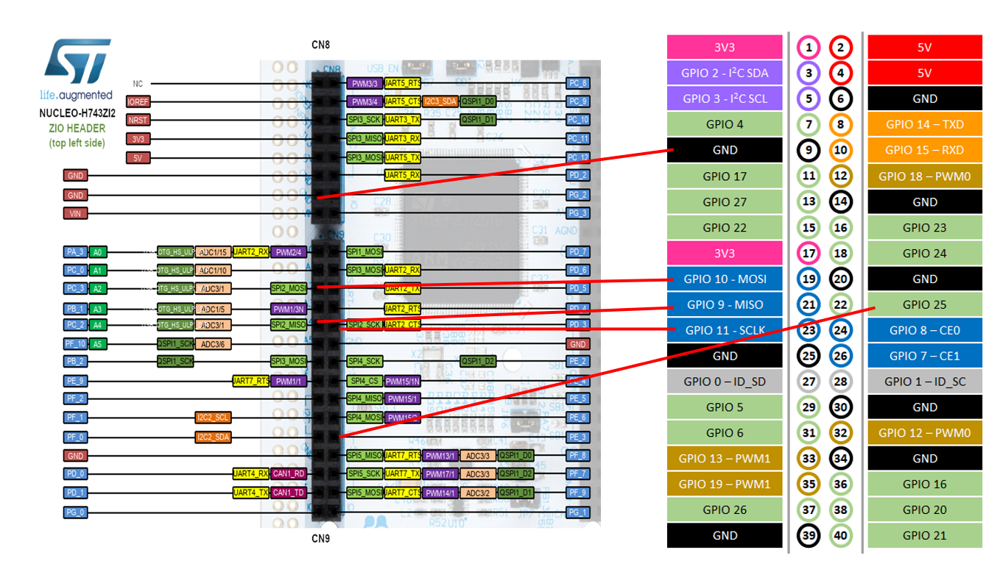
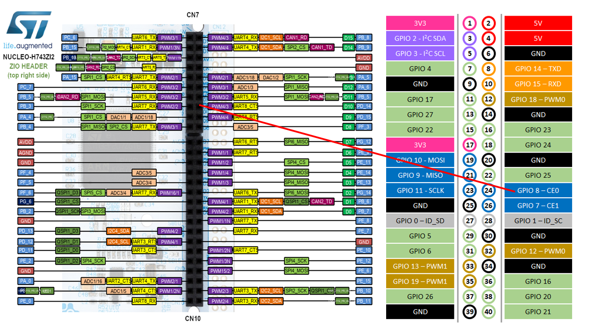

# STM32H755 SPI2 Slave ↔ Raspberry Pi CM5

## 1. Project Overview

本專案使用 **STM32H755** 作為 SPI Slave，搭配 **Raspberry Pi CM5** 作為 SPI Master，建立 STM32H755 與 Linux CM5 之間的高速資料傳輸通道。

目前的最終目標是：

```text
STM32H755
   │
   │ 每 1 ms 產生一筆 EtherCAT Data
   │
   │ 204 Bytes
   ▼
SPI2 Slave
   │
   │
   │ SPI
   ▼
Raspberry Pi CM5
   │
   │ GPIO25 Interrupt
   ▼
Linux SPI Master
   │
   ▼
204-byte Data
```

最終需要確認：

* 不遺失資料
* 不重複資料
* 不錯位
* sequence number 正確
* 長時間穩定運作
* 可以承受 1 ms 的資料產生週期

---

# 2. Hardware

## 2.1 STM32

使用：

```text
STM32H755ZIT6U
```

開發板：

```text
NUCLEO-H755ZI-Q
```

STM32H755 使用：

```text
CM7
```

執行目前 SPI Slave 測試程式。

---

## 2.2 Raspberry Pi

使用：

```text
Raspberry Pi CM5
```

目前 OS：

```text
Debian GNU/Linux 13 (trixie)
```

Kernel：

```text
Linux 6.18.34+rpt-rpi-2712
```

CM5 執行 Linux C++ SPI Master 測試程式。

---


# 硬體連接圖





---

# 3. SPI Architecture

目前架構：

```text
                 STM32H755
              ┌──────────────┐
              │     CM7      │
              │              │
              │ SPI2 Slave   │
              └──────┬───────┘
                     │
              SPI2 signals
                     │
        ┌────────────┼────────────┐
        │            │            │
       SCK          MOSI         MISO
        │            │            │
        ▼            ▼            ▼
     CM5 SPI Master / spidev
```

STM32 是：

```text
SPI Slave
```

CM5 是：

```text
SPI Master
```

因此：

> STM32 不會自己產生 SPI clock。

SPI clock 必須由 CM5 Master 產生。

---

# 4. SPI Configuration

STM32H755 SPI2：

```text
Mode          : Slave
Direction     : 2 Lines
Data Size     : 8-bit
Clock Polarity: LOW
Clock Phase   : 1EDGE
SPI Mode      : Mode 0
First Bit     : MSB
NSS           : Software
CRC           : Disabled
```

主要設定：

```c
hspi2.Instance = SPI2;

hspi2.Init.Mode = SPI_MODE_SLAVE;
hspi2.Init.Direction = SPI_DIRECTION_2LINES;
hspi2.Init.DataSize = SPI_DATASIZE_8BIT;

hspi2.Init.CLKPolarity = SPI_POLARITY_LOW;
hspi2.Init.CLKPhase = SPI_PHASE_1EDGE;

hspi2.Init.NSS = SPI_NSS_SOFT;

hspi2.Init.FirstBit = SPI_FIRSTBIT_MSB;
```

CM5：

```text
SPI device : /dev/spidev0.0
SPI mode   : 0
SPI speed  : 1 MHz
bits       : 8
```

---

# 5. GPIO Notification

SPI 本身沒有提供「資料已準備好」的通知機制。

因此額外使用：

```text
STM32 PE3
    ↓
CM5 GPIO25
```

作為 packet notification。

STM32：

```text
PE3 LOW
   │
   │ packet ready
   ▼
PE3 HIGH
```

CM5：

```text
GPIO25 RISING EDGE
        ↓
GPIO interrupt/event
        ↓
SPI Master transaction
```

也就是：

```text
STM32 PE3 LOW → HIGH
        ↓
CM5 GPIO25 RISING
        ↓
CM5 SPI transfer
```

---

# 6. Notification Protocol

目前採用：

```text
PE3 HIGH
    =
one packet is ready
```

STM32 執行：

```c
HAL_GPIO_WritePin(
    CM5_TRIG_GPIO_Port,
    CM5_TRIG_Pin,
    GPIO_PIN_SET);
```

通知 CM5。

接著：

```c
HAL_SPI_Transmit(...)
```

等待 CM5 Master 開始 SPI transaction。

SPI transaction 結束後：

```c
HAL_GPIO_WritePin(
    CM5_TRIG_GPIO_Port,
    CM5_TRIG_Pin,
    GPIO_PIN_RESET);
```

因此目前的邏輯是：

```text
PE3 HIGH
    │
    ├── CM5 detects rising edge
    │
    ├── CM5 asserts CS
    │
    ├── CM5 generates SCK
    │
    └── STM32 sends SPI data
              │
              ▼
          transaction done
              │
              ▼
          PE3 LOW
```

---

# 7. Current Test Packet

目前使用：

```text
16 Bytes
```

STM32 測試資料：

```text
Byte 0  : Sequence Number
Byte 1  : Reserved / 0x00
Byte 2  : 0x01
Byte 3  : 0x02
Byte 4  : 0x03
...
Byte 15 : 0x0E
```

目前實際資料形式：

```text
00 00 01 02 03 04 05 06
07 08 09 0A 0B 0C 0D 0E
```

下一筆：

```text
01 00 01 02 03 04 05 06
07 08 09 0A 0B 0C 0D 0E
```

再下一筆：

```text
02 00 01 02 03 04 05 06
07 08 09 0A 0B 0C 0D 0E
```

Sequence number 目前使用：

```text
uint8_t
```

因此範圍：

```text
0x00 ~ 0xFF
```

之後會自然 wrap-around：

```text
FE
FF
00
01
```

CM5 的 sequence verification 必須正確處理 wrap-around。

---

# 8. Sequence Number 的目的

Sequence number 並不是正式 EtherCAT protocol 的一部分。

它是目前 bring-up 階段增加的：

> **資料遺失 / 重複 / 順序錯誤驗證機制**

例如正常：

```text
0
1
2
3
4
5
6
7
```

代表：

```text
PASS
```

如果：

```text
0
1
3
4
```

則：

```text
2
```

可能遺失。

CM5 應該偵測：

```text
expected = 2
received = 3
```

並記錄：

```text
MISSING
```

如果：

```text
0
1
1
2
```

代表：

```text
DUPLICATE
```

如果：

```text
0
1
5
3
```

代表：

```text
OUT-OF-ORDER
```

---

# 9. STM32 Counters

目前 STM32 已加入基本 transaction counter。

例如：

```c
volatile uint32_t SPI2_SlaveTxCount = 0U;
volatile uint32_t SPI2_SlaveErrorCount = 0U;
```

另外已增加 HAL error diagnostic counters，用來區分：

```text
HAL_OK
HAL_TIMEOUT
HAL_BUSY
HAL_ERROR
```

以及：

```text
SPI2_SlaveLastHalError
```

記錄最近一次 HAL SPI error code。

這些 counter 的主要目的不是現在就直接解決問題，而是：

> **把「紅燈閃爍」從視覺現象變成可以量化的數據。**

---

# 10. STM32 LED Diagnostic

NUCLEO-H755ZI-Q 上目前使用三個 LED：

```text
LED_GREEN
LED_YELLOW
LED_RED
```

目前定義：

### Green LED

SPI transaction：

```text
HAL_OK
```

時：

```c
BSP_LED_Toggle(LED_GREEN);
```

因此：

```text
GREEN
=
SPI transmit success
```

---

### Red LED

SPI transaction：

```text
HAL_TIMEOUT
HAL_BUSY
HAL_ERROR
```

等非 `HAL_OK` 狀態時：

```c
BSP_LED_Toggle(LED_RED);
```

因此：

```text
RED
=
SPI transmit failure
```

---

### Yellow LED

黃色 LED 用於：

> **額外的 SPI error diagnostic indication**

目前主要目的是協助觀察：

```text
SPI error
```

發生的位置與頻率。

黃色 LED 的使用不應影響 SPI protocol。

---

# 11. STM32 SPI Test Function

目前核心測試函式：

```c
static HAL_StatusTypeDef SPI2_SlaveSendTestData(void)
```

主要流程：

```text
1. PE3 HIGH
       ↓
2. Notify CM5
       ↓
3. HAL_SPI_Transmit()
       ↓
4. CM5 reads data
       ↓
5. SPI transaction completed
       ↓
6. PE3 LOW
       ↓
7. Update counters
```

---

# 12. Important Synchronization Issue

早期測試發現：

```text
SEQ=0
```

曾經被 CM5 收到兩次。

當時 CM5 顯示：

```text
IRQ=1
SEQ=0 PASS

IRQ=2
SEQ=0 DUPLICATE
```

之後才開始：

```text
SEQ=1
SEQ=2
SEQ=3
...
```

因此推測：

> STM32 與 CM5 在測試啟動時存在同步/啟動時序問題。

經過在 STM32 啟動測試前加入約：

```text
5 seconds
```

的 startup delay 後，重新測試：

```text
SEQ=0
SEQ=1
SEQ=2
SEQ=3
...
```

已恢復正常。

---

# 13. Current Verified Result

最新測試結果：

```text
IRQ=1   SEQ=0   PASS
IRQ=2   SEQ=1   PASS
IRQ=3   SEQ=2   PASS
IRQ=4   SEQ=3   PASS
...
IRQ=20  SEQ=19  PASS
```

統計：

```text
IRQ        = 20
SPI        = 20
PASS       = 20
FAIL       = 0
SEQ_ERR    = 0
MISSING    = 0
DUP/OOO    = 0
```

因此目前至少已驗證：

```text
GPIO notification       PASS
GPIO25 rising detection PASS
CM5 SPI Master trigger  PASS
SPI Mode 0              PASS
SPI 1 MHz               PASS
16-byte transfer        PASS
STM32 SPI2 Slave        PASS
RX data correctness     PASS
Repeated transfer       PASS
Sequence verification   PASS
No missing sequence     PASS
No duplicate sequence   PASS
```

---

# 14. Verified Communication Chain

目前已實際驗證：

```text
STM32H755 PE3
      │
      │ rising edge
      ▼
CM5 GPIO25
      │
      │ GPIO event
      ▼
C++ program wakes
      │
      ▼
SPI Master
      │
      │ CS
      │ SCK
      ▼
STM32 SPI2 Slave
      │
      │ 16 bytes
      ▼
CM5 RX buffer
      │
      ▼
Sequence verification
      │
      ▼
PASS
```

這條鏈路已經不是理論設計，而是：

> **實際硬體測試成功。**

---

# 15. Current Test Frequency

目前 STM32 測試程式使用：

```c
#define SPI2_SLAVE_TEST_INTERVAL_MS 500U
```

也就是約：

```text
500 ms
```

傳送一次。

因此目前：

```text
2 packets / second
```

左右。

這只是 bring-up 測試。

不是最終資料傳輸速度。

---

# 16. Why 500 ms Is Used

目前 500 ms 的目的：

* 容易觀察 LED
* 容易觀察 console
* 容易分析 GPIO interrupt
* 容易分析 SPI transaction
* 降低同步問題複雜度
* 避免在基本功能尚未確認前加入高頻率因素

因此：

> **目前不應把 500 ms 視為正式 protocol timing。**

---

# 17. Final Target

最終資料：

```text
204 Bytes
```

頻率：

```text
1 ms / packet
```

也就是：

```text
1000 packets / second
```

資料率：

```text
204 Bytes × 1000
=
204,000 Bytes/s
```

約：

```text
1.632 Mbps
```

純 payload。

但是 SPI transaction 還包含實際 bus timing，因此 clock 必須高於這個數值。

---

# 18. Important SPI Clock Calculation

如果 SPI clock 是：

```text
1 MHz
```

傳送 204 Bytes 需要：

```text
204 × 8 bits
=
1632 bits
```

所以：

```text
1632 / 1,000,000
=
1.632 ms
```

因此：

> **1 MHz SPI 不適合直接作為最終 204-byte / 1-ms configuration。**

因為：

```text
Required period = 1 ms
Transfer time   = 1.632 ms
```

已經超過一個 1-ms period。

因此進入 204-byte 測試後，需要逐步提高 SPI clock，例如：

```text
1 MHz
↓
2 MHz
↓
4 MHz
↓
8 MHz
...
```

每一步都重新驗證。

---

# 19. Development Strategy

本專案採用：

> **Incremental Bring-Up**

而不是一次直接進入 204-byte / 1-ms。

目前規劃：

```text
Phase 1
16-byte IRQ-triggered SPI
        ↓
PASS
        ↓
Completed
```

---

## Phase 2

確認 STM32 SPI transaction status：

```text
HAL_OK
HAL_TIMEOUT
HAL_BUSY
HAL_ERROR
```

並建立：

```text
TX success counter
TX error counter
timeout counter
busy counter
HAL error counter
last error code
```

目的：

> 確認紅色 LED 是否真的代表 SPI failure，以及 failure 的類型。

---

## Phase 3

改成：

```text
204-byte IRQ-triggered SPI
```

但先保持低頻率。

例如：

```text
100 ms
```

甚至：

```text
500 ms
```

先驗證：

```text
204 bytes
+
sequence
+
GPIO notification
+
SPI
```

全部正常。

---

## Phase 4

逐步提高 notification frequency：

```text
500 ms
↓
100 ms
↓
50 ms
↓
10 ms
↓
5 ms
↓
2 ms
↓
1 ms
```

每個階段都必須確認：

```text
IRQ count
SPI count
PASS count
FAIL count
SEQ error
MISSING
DUP/OOO
```

---

# 20. Phase 5 — 1 ms Target

目標：

```text
STM32
  │
  ├─ packet 0
  ├─ packet 1
  ├─ packet 2
  ├─ packet 3
  │    ...
  └─ every 1 ms
```

每筆：

```text
204 Bytes
```

CM5：

```text
GPIO25 interrupt
       ↓
SPI transfer
       ↓
204-byte RX
       ↓
sequence verification
```

---

# 21. Data Loss Verification

最重要的驗證不是：

```text
SPI 可以收到資料
```

而是：

```text
所有 packet 都有收到
```

因此 sequence number 必須持續存在於測試 packet 中。

例如 STM32：

```text
0
1
2
3
4
5
...
```

CM5 必須得到：

```text
0
1
2
3
4
5
...
```

如果出現：

```text
0
1
2
4
5
```

則：

```text
SEQ 3 missing
```

表示資料遺失。

---

# 22. Notification Loss

還需要分開驗證：

```text
STM32 notification count
```

與：

```text
CM5 IRQ count
```

是否一致。

理想狀態：

```text
STM32 notification = CM5 IRQ
```

例如：

```text
STM32 notification = 10000
CM5 IRQ             = 10000
```

才表示 notification 沒有明顯遺失。

---

# 23. SPI Transaction Verification

同時需要：

```text
CM5 IRQ count
CM5 SPI count
```

一致：

```text
IRQ = SPI
```

例如：

```text
IRQ=10000
SPI=10000
```

如果：

```text
IRQ=10000
SPI=9998
```

則代表有 notification 到達，但 SPI transaction 沒有完成。

---

# 24. Final Cross-Check

最終希望建立：

```text
STM32 TX attempt
        =
CM5 IRQ
        =
CM5 SPI transaction
        =
CM5 PASS
```

例如：

```text
STM32 TX       = 1,000,000
STM32 ERROR    = 0

CM5 IRQ        = 1,000,000
CM5 SPI        = 1,000,000
CM5 PASS       = 1,000,000
CM5 FAIL       = 0

SEQ_ERR        = 0
MISSING        = 0
DUP/OOO        = 0
```

這才是我們真正想得到的結果。

---

# 25. Important Design Principle

目前 PE3 notification 的語意是：

```text
one rising edge = one packet ready
```

因此必須非常注意：

> GPIO notification 不是資料本身。

SPI data 與 GPIO notification 必須保持同步。

如果 STM32 在 CM5 尚未完成上一個 transaction 時，又產生下一個 packet notification，就可能造成：

```text
notification overlap
```

甚至：

```text
packet overwrite
packet loss
sequence discontinuity
```

因此進入 1-ms 階段後，這會是重要的驗證項目。

---

# 26. Current Known Limitation

目前還不能宣稱：

```text
1 ms / 204 bytes
```

已經成功。

目前只證明：

```text
16 bytes
500 ms interval
1 MHz
```

可以穩定傳輸。

因此目前狀態應標記為：

```text
16-byte Bring-Up: PASS

204-byte: NOT TESTED YET

1-ms operation: NOT VERIFIED YET

Long-duration test: NOT COMPLETED

EtherCAT real data: NOT CONNECTED YET
```

---

# 27. Recommended Git Checkpoint

目前版本應保存為一個明確的 baseline。

建議 Git commit：

```text
SPI 16-byte IRQ-triggered baseline PASS
```

建議 tag：

```text
v0.1-spi-16byte-baseline
```

這個版本的重要性：

> 後續所有 204-byte / 1-ms 實驗如果出現問題，都可以回到這個版本確認硬體與基本 SPI path。

---

# 28. Do Not Modify the Baseline Without a Checkpoint

在進入下一階段之前：

```text
Git commit
        ↓
16-byte PASS baseline
        ↓
開始 204-byte experiment
```

如果新版本失敗：

```text
Git checkout baseline
        ↓
重新確認 16-byte PASS
```

避免不同階段的修改互相污染。

---

# 29. Next Development Step

下一步不是直接追求 1 ms。

應該：

```text
16-byte PASS
      ↓
204-byte
      ↓
low frequency
      ↓
sequence verification
      ↓
increase SPI clock
      ↓
increase frequency
      ↓
1 ms
      ↓
long-duration test
      ↓
real EtherCAT data
```

每一階段都必須有明確的 PASS criteria。

---

# 30. Final Goal

最終系統：

```text
                 STM32H755 CM7
                      │
                      │
             EtherCAT processing
                      │
                      ▼
               204-byte data
                      │
                      │ every 1 ms
                      ▼
                SPI2 Slave
                      │
                      │
                 PE3 HIGH
                      │
                      ▼
              CM5 GPIO25 IRQ
                      │
                      ▼
               SPI Master
                      │
                      ▼
                 204-byte RX
                      │
                      ▼
              Sequence Check
                      │
          ┌───────────┼───────────┐
          ▼           ▼           ▼
       No Loss    No Duplicate  No OOO
          │           │           │
          └───────────┼───────────┘
                      ▼
                PASS
```

最終驗證條件：

```text
204 Bytes / packet
1000 packets / second
1 ms period
No packet loss
No duplicate
No out-of-order
No corruption
No SPI timeout
No SPI busy
No HAL error
Stable for long-duration testing
```

---

# 31. Current Status

| Item                    | Status    |
| ----------------------- | --------- |
| STM32H755 CM7           | PASS      |
| SPI2 Slave              | PASS      |
| SPI Mode 0              | PASS      |
| SPI 1 MHz               | PASS      |
| PE3 notification        | PASS      |
| CM5 GPIO25 interrupt    | PASS      |
| 16-byte transfer        | PASS      |
| Sequence number         | PASS      |
| Sequence continuity     | PASS      |
| Missing detection       | PASS      |
| Duplicate/OoO detection | PASS      |
| 204-byte transfer       | ⏳ Pending |
| High-frequency transfer | ⏳ Pending |
| 1-ms transfer           | ⏳ Pending |
| Long-duration test      | ⏳ Pending |
| EtherCAT real data      | ⏳ Pending |

---

# 32. Conclusion

目前已經完成最重要的第一個硬體 Bring-Up checkpoint：

> **STM32H755 SPI2 Slave 與 Raspberry Pi CM5 SPI Master 已經可以透過 PE3/GPIO25 notification 可靠完成 16-byte SPI data transfer。**

最新測試：

```text
IRQ=20
SPI=20
PASS=20
FAIL=0
SEQ_ERR=0
MISSING=0
DUP/OOO=0
```

表示目前 baseline 已經成功。

接下來的重點不是再證明：

> 「SPI 能不能傳？」

而是逐步回答：

> **「在 204-byte、1-ms、長時間連續傳輸的條件下，資料是否能做到零遺失、零重複、零錯位？」**

因此後續所有修改都必須以目前的：

```text
16-byte IRQ-triggered SPI PASS
```

作為基準，採取小幅度、可驗證、可回退的方式進行。


# 檔案修改
### [2026-08-25] 檔案架構修改

```text
Core/
└── Src/
    └── main.c

Core/
├── Inc/
│   └── spi2_slave.h
│
└── Src/
    ├── main.c
    └── spi2_slave.c
```

責任如下：

main.c

只負責：

- STM32H755 啟動
- Clock
- GPIO
- SPI2 peripheral initialization（CubeMX）
- LED / COM 初始化
- 測試程式的控制流程

spi2_slave.c  
負責：

- SPI2 Slave 傳送
- PE3 → CM5 notification
- sequence number
- SPI error counter
- timeout / busy / HAL error
- Yellow LED debug
- 未來 204-byte SPI 傳送的底層實作

只提供一個使用的公開 API：
```c
HAL_StatusTypeDef SPI2_Slave_SendPacket(const uint8_t *data,
                                        uint16_t length);
```

## 修改完成後的架構

```text
                    STM32H755 CM7
┌──────────────────────────────────────────────┐
│                                              │
│                  main.c                      │
│                                              │
│  HAL_Init()                                  │
│  SystemClock_Config()                        │
│  MX_GPIO_Init()                              │
│  MX_SPI2_Init()                              │
│                                              │
│       Temporary test only                    │
│              │                               │
│              ▼                               │
│  SPI2_Slave_SendPacket()                     │
│              │                               │
└──────────────┼───────────────────────────────┘
               │
               ▼
       ┌──────────────────┐
       │  spi2_slave.c    │
       │                  │
       │ PE3 notification │
       │ SPI2 transmit    │
       │ error handling   │
       │ debug counters   │
       │ yellow LED       │
       └────────┬─────────┘
                │
                │ SPI2
                │
                ▼
        Raspberry Pi CM5
```
未來看到的介面只有：
```c
SPI2_Slave_SendPacket(data, length);
```

### 測試結果

```text
herman@RPiCM5:~/spi-master-test $ ./spi_master_irq_16byte_test
========================================
CM5 SPI Master + GPIO25 Interrupt Test
========================================
GPIO chip : /dev/gpiochip0
GPIO line : 25
Edge      : RISING
SPI device: /dev/spidev0.0
SPI mode  : 0
SPI speed : 1000000 Hz
RX size   : 16 bytes
========================================
[SPI] Device       : /dev/spidev0.0
[SPI] Mode         : 0
[SPI] Bits         : 8
[SPI] Speed        : 1000000 Hz
[TEST] Expected RX : 00 00 01 02 03 04 05 06 07 08 09 0A 0B 0C 0D 0E
========================================
Waiting for STM32H755 PE3...
========================================

[13:09:55] GPIO25 RISING  IRQ=1
[SPI] Starting Master transaction...
[SPI] RX data : 00 00 01 02 03 04 05 06 07 08 09 0A 0B 0C 0D 0E
[SEQ] Received=0
[VERIFY] PASS
[STAT] IRQ=1 SPI=1 PASS=1 FAIL=0 SEQ_ERR=0 MISSING=0 DUP/OOO=0
Waiting for next STM32H755 PE3...

[13:09:55] GPIO25 RISING  IRQ=2
[SPI] Starting Master transaction...
[SPI] RX data : 01 00 01 02 03 04 05 06 07 08 09 0A 0B 0C 0D 0E
[SEQ] Received=1
[VERIFY] PASS
[STAT] IRQ=2 SPI=2 PASS=2 FAIL=0 SEQ_ERR=0 MISSING=0 DUP/OOO=0
Waiting for next STM32H755 PE3...

[13:09:56] GPIO25 RISING  IRQ=3
[SPI] Starting Master transaction...
[SPI] RX data : 02 00 01 02 03 04 05 06 07 08 09 0A 0B 0C 0D 0E
[SEQ] Received=2
[VERIFY] PASS
[STAT] IRQ=3 SPI=3 PASS=3 FAIL=0 SEQ_ERR=0 MISSING=0 DUP/OOO=0
Waiting for next STM32H755 PE3...

[13:09:56] GPIO25 RISING  IRQ=4
[SPI] Starting Master transaction...
[SPI] RX data : 03 00 01 02 03 04 05 06 07 08 09 0A 0B 0C 0D 0E
[SEQ] Received=3
[VERIFY] PASS
[STAT] IRQ=4 SPI=4 PASS=4 FAIL=0 SEQ_ERR=0 MISSING=0 DUP/OOO=0
Waiting for next STM32H755 PE3...

[13:09:57] GPIO25 RISING  IRQ=5
[SPI] Starting Master transaction...
[SPI] RX data : 04 00 01 02 03 04 05 06 07 08 09 0A 0B 0C 0D 0E
[SEQ] Received=4
[VERIFY] PASS
[STAT] IRQ=5 SPI=5 PASS=5 FAIL=0 SEQ_ERR=0 MISSING=0 DUP/OOO=0
Waiting for next STM32H755 PE3...

[13:09:57] GPIO25 RISING  IRQ=6
[SPI] Starting Master transaction...
[SPI] RX data : 05 00 01 02 03 04 05 06 07 08 09 0A 0B 0C 0D 0E
[SEQ] Received=5
[VERIFY] PASS
[STAT] IRQ=6 SPI=6 PASS=6 FAIL=0 SEQ_ERR=0 MISSING=0 DUP/OOO=0
Waiting for next STM32H755 PE3...

[13:09:58] GPIO25 RISING  IRQ=7
[SPI] Starting Master transaction...
[SPI] RX data : 06 00 01 02 03 04 05 06 07 08 09 0A 0B 0C 0D 0E
[SEQ] Received=6
[VERIFY] PASS
[STAT] IRQ=7 SPI=7 PASS=7 FAIL=0 SEQ_ERR=0 MISSING=0 DUP/OOO=0
Waiting for next STM32H755 PE3...

[13:09:58] GPIO25 RISING  IRQ=8
[SPI] Starting Master transaction...
[SPI] RX data : 07 00 01 02 03 04 05 06 07 08 09 0A 0B 0C 0D 0E
[SEQ] Received=7
[VERIFY] PASS
[STAT] IRQ=8 SPI=8 PASS=8 FAIL=0 SEQ_ERR=0 MISSING=0 DUP/OOO=0
Waiting for next STM32H755 PE3...

[13:09:59] GPIO25 RISING  IRQ=9
[SPI] Starting Master transaction...
[SPI] RX data : 08 00 01 02 03 04 05 06 07 08 09 0A 0B 0C 0D 0E
[SEQ] Received=8
[VERIFY] PASS
[STAT] IRQ=9 SPI=9 PASS=9 FAIL=0 SEQ_ERR=0 MISSING=0 DUP/OOO=0
Waiting for next STM32H755 PE3...

[13:09:59] GPIO25 RISING  IRQ=10
[SPI] Starting Master transaction...
[SPI] RX data : 09 00 01 02 03 04 05 06 07 08 09 0A 0B 0C 0D 0E
[SEQ] Received=9
[VERIFY] PASS
[STAT] IRQ=10 SPI=10 PASS=10 FAIL=0 SEQ_ERR=0 MISSING=0 DUP/OOO=0
Waiting for next STM32H755 PE3...

```

## 基礎 SPI Slave/Interrupt 架構驗證
```text
STM32H755 CM7
     │
     │ 產生 16-byte packet
     │
     ▼
SPI2 Slave
     │
     │ PE3 = HIGH
     ▼
CM5 GPIO25 Rising Edge
     │
     ▼
CM5 SPI Master
     │
     │ 16-byte SPI transaction
     ▼
收到 packet
     │
     ├── Sequence Number 檢查
     │
     └── Payload Pattern 檢查
     ▼
PASS
```

### Phase A — 已完成
```text
500 ms
16 bytes
GPIO interrupt
SPI Master/Slave
Sequence verification
```

```text
CM7
├── Core/Inc/
│   └── spi2_slave.h
│       └── 唯一對外 API
│           SPI2_Slave_SendPacket()
│
├── Core/Src/
│   ├── spi2_slave.c
│   │   └── SPI2 Slave 實際傳送
│   │       ├── PE3 HIGH
│   │       ├── HAL_SPI_Transmit()
│   │       ├── PE3 LOW
│   │       └── error/counter
│   │
│   └── main.c
│       └── CubeMX 初始化
│       └── 目前暫時的 500 ms test producer
```

> 這個版本已經確認 SPI2 Slave + PE3 trigger + CM5 GPIO25 interrupt + 16-byte sequence validation 全部正常。 確認這次分割檔案是成功的。

> PE3 → GPIO25 IRQ → CM5 SPI Master → STM32 SPI Slave → 16 bytes → sequence verification  

# 更新版本
## [2026-08-26] 修改檔案 spi_master_irq_16byte_test.cpp
### 修改原因： 增加 四個 Ring Buffer


