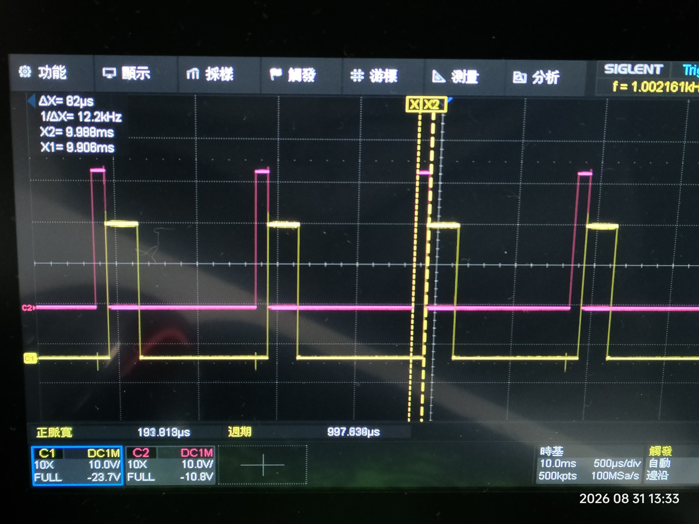
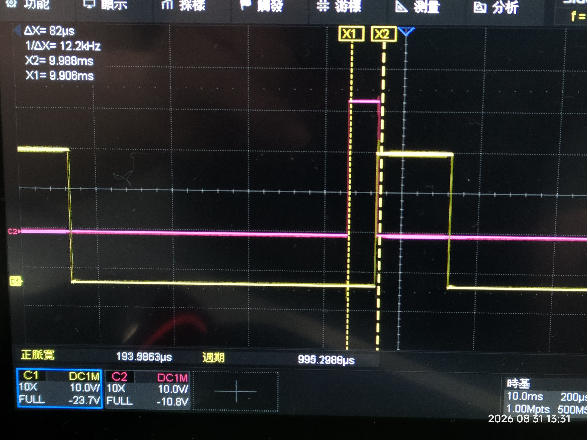
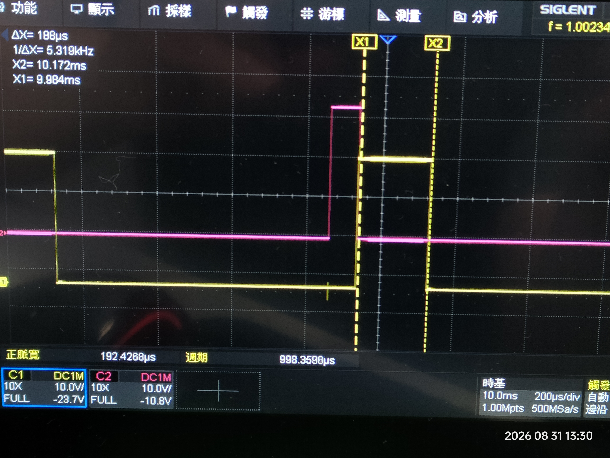

# STM32H755 SPI2 Slave ↔ Raspberry Pi CM5

## 1. Project Overview

本專案使用 **STM32H755** 作為 SPI Slave，搭配 **Raspberry Pi CM5** 作為 SPI Master，建立 STM32H755 與 Linux CM5 之間的高速資料傳輸通道。

目前的最終目標是：

```text
STM32H755
   │
   │ 每 1 ms 產生一筆 EtherCAT Data
   │
   │ 204 Bytes
   ▼
SPI2 Slave
   │
   │
   │ SPI
   ▼
Raspberry Pi CM5
   │
   │ GPIO25 Interrupt
   ▼
Linux SPI Master
   │
   ▼
204-byte Data
```

最終需要確認：

* 不遺失資料
* 不重複資料
* 不錯位
* sequence number 正確
* 長時間穩定運作
* 可以承受 1 ms 的資料產生週期

---

# 2. Hardware

## 2.1 STM32

使用：

```text
STM32H755ZIT6U
```

開發板：

```text
NUCLEO-H755ZI-Q
```

STM32H755 使用：

```text
CM7
```

執行目前 SPI Slave 測試程式。

---

## 2.2 Raspberry Pi

使用：

```text
Raspberry Pi CM5
```

目前 OS：

```text
Debian GNU/Linux 13 (trixie)
```

Kernel：

```text
Linux 6.18.34+rpt-rpi-2712
```

CM5 執行 Linux C++ SPI Master 測試程式。

---


# 硬體連接圖


---

# 3. SPI Architecture

目前架構：

```text
                 STM32H755
              ┌──────────────┐
              │     CM7      │
              │              │
              │ SPI2 Slave   │
              └──────┬───────┘
                     │
              SPI2 signals
                     │
        ┌────────────┼────────────┐
        │            │            │
       SCK          MOSI         MISO
        │            │            │
        ▼            ▼            ▼
     CM5 SPI Master / spidev
```

STM32 是：

```text
SPI Slave
```

CM5 是：

```text
SPI Master
```

因此：

> STM32 不會自己產生 SPI clock。

SPI clock 必須由 CM5 Master 產生。

---

# 4. SPI Configuration

STM32H755 SPI2：

```text
Mode          : Slave
Direction     : 2 Lines
Data Size     : 8-bit
Clock Polarity: LOW
Clock Phase   : 1EDGE
SPI Mode      : Mode 0
First Bit     : MSB
NSS           : Software
CRC           : Disabled
```

主要設定：

```c
hspi2.Instance = SPI2;

hspi2.Init.Mode = SPI_MODE_SLAVE;
hspi2.Init.Direction = SPI_DIRECTION_2LINES;
hspi2.Init.DataSize = SPI_DATASIZE_8BIT;

hspi2.Init.CLKPolarity = SPI_POLARITY_LOW;
hspi2.Init.CLKPhase = SPI_PHASE_1EDGE;

hspi2.Init.NSS = SPI_NSS_SOFT;

hspi2.Init.FirstBit = SPI_FIRSTBIT_MSB;
```

CM5：

```text
SPI device : /dev/spidev0.0
SPI mode   : 0
SPI speed  : 1 MHz
bits       : 8
```

---

# 5. GPIO Notification

SPI 本身沒有提供「資料已準備好」的通知機制。

因此額外使用：

```text
STM32 PE3
    ↓
CM5 GPIO25
```

作為 packet notification。

STM32：

```text
PE3 LOW
   │
   │ packet ready
   ▼
PE3 HIGH
```

CM5：

```text
GPIO25 RISING EDGE
        ↓
GPIO interrupt/event
        ↓
SPI Master transaction
```

也就是：

```text
STM32 PE3 LOW → HIGH
        ↓
CM5 GPIO25 RISING
        ↓
CM5 SPI transfer
```

---

# 6. Notification Protocol

目前採用：

```text
PE3 HIGH
    =
one packet is ready
```

STM32 執行：

```c
HAL_GPIO_WritePin(
    CM5_TRIG_GPIO_Port,
    CM5_TRIG_Pin,
    GPIO_PIN_SET);
```

通知 CM5。

接著：

```c
HAL_SPI_Transmit(...)
```

等待 CM5 Master 開始 SPI transaction。

SPI transaction 結束後：

```c
HAL_GPIO_WritePin(
    CM5_TRIG_GPIO_Port,
    CM5_TRIG_Pin,
    GPIO_PIN_RESET);
```

因此目前的邏輯是：

```text
PE3 HIGH
    │
    ├── CM5 detects rising edge
    │
    ├── CM5 asserts CS
    │
    ├── CM5 generates SCK
    │
    └── STM32 sends SPI data
              │
              ▼
          transaction done
              │
              ▼
          PE3 LOW
```

---

# 7. Current Test Packet

目前使用：

```text
16 Bytes
```

STM32 測試資料：

```text
Byte 0  : Sequence Number
Byte 1  : Reserved / 0x00
Byte 2  : 0x01
Byte 3  : 0x02
Byte 4  : 0x03
...
Byte 15 : 0x0E
```

目前實際資料形式：

```text
00 00 01 02 03 04 05 06
07 08 09 0A 0B 0C 0D 0E
```

下一筆：

```text
01 00 01 02 03 04 05 06
07 08 09 0A 0B 0C 0D 0E
```

再下一筆：

```text
02 00 01 02 03 04 05 06
07 08 09 0A 0B 0C 0D 0E
```

Sequence number 目前使用：

```text
uint8_t
```

因此範圍：

```text
0x00 ~ 0xFF
```

之後會自然 wrap-around：

```text
FE
FF
00
01
```

CM5 的 sequence verification 必須正確處理 wrap-around。

---

# 8. Sequence Number 的目的

Sequence number 並不是正式 EtherCAT protocol 的一部分。

它是目前 bring-up 階段增加的：

> **資料遺失 / 重複 / 順序錯誤驗證機制**

例如正常：

```text
0
1
2
3
4
5
6
7
```

代表：

```text
PASS
```

如果：

```text
0
1
3
4
```

則：

```text
2
```

可能遺失。

CM5 應該偵測：

```text
expected = 2
received = 3
```

並記錄：

```text
MISSING
```

如果：

```text
0
1
1
2
```

代表：

```text
DUPLICATE
```

如果：

```text
0
1
5
3
```

代表：

```text
OUT-OF-ORDER
```

---

# 9. STM32 Counters

目前 STM32 已加入基本 transaction counter。

例如：

```c
volatile uint32_t SPI2_SlaveTxCount = 0U;
volatile uint32_t SPI2_SlaveErrorCount = 0U;
```

另外已增加 HAL error diagnostic counters，用來區分：

```text
HAL_OK
HAL_TIMEOUT
HAL_BUSY
HAL_ERROR
```

以及：

```text
SPI2_SlaveLastHalError
```

記錄最近一次 HAL SPI error code。

這些 counter 的主要目的不是現在就直接解決問題，而是：

> **把「紅燈閃爍」從視覺現象變成可以量化的數據。**

---

# 10. STM32 LED Diagnostic

NUCLEO-H755ZI-Q 上目前使用三個 LED：

```text
LED_GREEN
LED_YELLOW
LED_RED
```

目前定義：

### Green LED

SPI transaction：

```text
HAL_OK
```

時：

```c
BSP_LED_Toggle(LED_GREEN);
```

因此：

```text
GREEN
=
SPI transmit success
```

---

### Red LED

SPI transaction：

```text
HAL_TIMEOUT
HAL_BUSY
HAL_ERROR
```

等非 `HAL_OK` 狀態時：

```c
BSP_LED_Toggle(LED_RED);
```

因此：

```text
RED
=
SPI transmit failure
```

---

### Yellow LED

黃色 LED 用於：

> **額外的 SPI error diagnostic indication**

目前主要目的是協助觀察：

```text
SPI error
```

發生的位置與頻率。

黃色 LED 的使用不應影響 SPI protocol。

---

# 11. STM32 SPI Test Function

目前核心測試函式：

```c
static HAL_StatusTypeDef SPI2_SlaveSendTestData(void)
```

主要流程：

```text
1. PE3 HIGH
       ↓
2. Notify CM5
       ↓
3. HAL_SPI_Transmit()
       ↓
4. CM5 reads data
       ↓
5. SPI transaction completed
       ↓
6. PE3 LOW
       ↓
7. Update counters
```

---

# 12. Important Synchronization Issue

早期測試發現：

```text
SEQ=0
```

曾經被 CM5 收到兩次。

當時 CM5 顯示：

```text
IRQ=1
SEQ=0 PASS

IRQ=2
SEQ=0 DUPLICATE
```

之後才開始：

```text
SEQ=1
SEQ=2
SEQ=3
...
```

因此推測：

> STM32 與 CM5 在測試啟動時存在同步/啟動時序問題。

經過在 STM32 啟動測試前加入約：

```text
5 seconds
```

的 startup delay 後，重新測試：

```text
SEQ=0
SEQ=1
SEQ=2
SEQ=3
...
```

已恢復正常。

---

# 13. Current Verified Result

最新測試結果：

```text
IRQ=1   SEQ=0   PASS
IRQ=2   SEQ=1   PASS
IRQ=3   SEQ=2   PASS
IRQ=4   SEQ=3   PASS
...
IRQ=20  SEQ=19  PASS
```

統計：

```text
IRQ        = 20
SPI        = 20
PASS       = 20
FAIL       = 0
SEQ_ERR    = 0
MISSING    = 0
DUP/OOO    = 0
```

因此目前至少已驗證：

```text
GPIO notification       PASS
GPIO25 rising detection PASS
CM5 SPI Master trigger  PASS
SPI Mode 0              PASS
SPI 1 MHz               PASS
16-byte transfer        PASS
STM32 SPI2 Slave        PASS
RX data correctness     PASS
Repeated transfer       PASS
Sequence verification   PASS
No missing sequence     PASS
No duplicate sequence   PASS
```

---

# 14. Verified Communication Chain

目前已實際驗證：

```text
STM32H755 PE3
      │
      │ rising edge
      ▼
CM5 GPIO25
      │
      │ GPIO event
      ▼
C++ program wakes
      │
      ▼
SPI Master
      │
      │ CS
      │ SCK
      ▼
STM32 SPI2 Slave
      │
      │ 16 bytes
      ▼
CM5 RX buffer
      │
      ▼
Sequence verification
      │
      ▼
PASS
```

這條鏈路已經不是理論設計，而是：

> **實際硬體測試成功。**

---

# 15. Current Test Frequency

目前 STM32 測試程式使用：

```c
#define SPI2_SLAVE_TEST_INTERVAL_MS 500U
```

也就是約：

```text
500 ms
```

傳送一次。

因此目前：

```text
2 packets / second
```

左右。

這只是 bring-up 測試。

不是最終資料傳輸速度。

---

# 16. Why 500 ms Is Used

目前 500 ms 的目的：

* 容易觀察 LED
* 容易觀察 console
* 容易分析 GPIO interrupt
* 容易分析 SPI transaction
* 降低同步問題複雜度
* 避免在基本功能尚未確認前加入高頻率因素

因此：

> **目前不應把 500 ms 視為正式 protocol timing。**

---

# 17. Final Target

最終資料：

```text
204 Bytes
```

頻率：

```text
1 ms / packet
```

也就是：

```text
1000 packets / second
```

資料率：

```text
204 Bytes × 1000
=
204,000 Bytes/s
```

約：

```text
1.632 Mbps
```

純 payload。

但是 SPI transaction 還包含實際 bus timing，因此 clock 必須高於這個數值。

---

# 18. Important SPI Clock Calculation

如果 SPI clock 是：

```text
1 MHz
```

傳送 204 Bytes 需要：

```text
204 × 8 bits
=
1632 bits
```

所以：

```text
1632 / 1,000,000
=
1.632 ms
```

因此：

> **1 MHz SPI 不適合直接作為最終 204-byte / 1-ms configuration。**

因為：

```text
Required period = 1 ms
Transfer time   = 1.632 ms
```

已經超過一個 1-ms period。

因此進入 204-byte 測試後，需要逐步提高 SPI clock，例如：

```text
1 MHz
↓
2 MHz
↓
4 MHz
↓
8 MHz
...
```

每一步都重新驗證。

---

# 19. Development Strategy

本專案採用：

> **Incremental Bring-Up**

而不是一次直接進入 204-byte / 1-ms。

目前規劃：

```text
Phase 1
16-byte IRQ-triggered SPI
        ↓
PASS
        ↓
Completed
```

---

## Phase 2

確認 STM32 SPI transaction status：

```text
HAL_OK
HAL_TIMEOUT
HAL_BUSY
HAL_ERROR
```

並建立：

```text
TX success counter
TX error counter
timeout counter
busy counter
HAL error counter
last error code
```

目的：

> 確認紅色 LED 是否真的代表 SPI failure，以及 failure 的類型。

---

## Phase 3

改成：

```text
204-byte IRQ-triggered SPI
```

但先保持低頻率。

例如：

```text
100 ms
```

甚至：

```text
500 ms
```

先驗證：

```text
204 bytes
+
sequence
+
GPIO notification
+
SPI
```

全部正常。

---

## Phase 4

逐步提高 notification frequency：

```text
500 ms
↓
100 ms
↓
50 ms
↓
10 ms
↓
5 ms
↓
2 ms
↓
1 ms
```

每個階段都必須確認：

```text
IRQ count
SPI count
PASS count
FAIL count
SEQ error
MISSING
DUP/OOO
```

---

# 20. Phase 5 — 1 ms Target

目標：

```text
STM32
  │
  ├─ packet 0
  ├─ packet 1
  ├─ packet 2
  ├─ packet 3
  │    ...
  └─ every 1 ms
```

每筆：

```text
204 Bytes
```

CM5：

```text
GPIO25 interrupt
       ↓
SPI transfer
       ↓
204-byte RX
       ↓
sequence verification
```

---

# 21. Data Loss Verification

最重要的驗證不是：

```text
SPI 可以收到資料
```

而是：

```text
所有 packet 都有收到
```

因此 sequence number 必須持續存在於測試 packet 中。

例如 STM32：

```text
0
1
2
3
4
5
...
```

CM5 必須得到：

```text
0
1
2
3
4
5
...
```

如果出現：

```text
0
1
2
4
5
```

則：

```text
SEQ 3 missing
```

表示資料遺失。

---

# 22. Notification Loss

還需要分開驗證：

```text
STM32 notification count
```

與：

```text
CM5 IRQ count
```

是否一致。

理想狀態：

```text
STM32 notification = CM5 IRQ
```

例如：

```text
STM32 notification = 10000
CM5 IRQ             = 10000
```

才表示 notification 沒有明顯遺失。

---

# 23. SPI Transaction Verification

同時需要：

```text
CM5 IRQ count
CM5 SPI count
```

一致：

```text
IRQ = SPI
```

例如：

```text
IRQ=10000
SPI=10000
```

如果：

```text
IRQ=10000
SPI=9998
```

則代表有 notification 到達，但 SPI transaction 沒有完成。

---

# 24. Final Cross-Check

最終希望建立：

```text
STM32 TX attempt
        =
CM5 IRQ
        =
CM5 SPI transaction
        =
CM5 PASS
```

例如：

```text
STM32 TX       = 1,000,000
STM32 ERROR    = 0

CM5 IRQ        = 1,000,000
CM5 SPI        = 1,000,000
CM5 PASS       = 1,000,000
CM5 FAIL       = 0

SEQ_ERR        = 0
MISSING        = 0
DUP/OOO        = 0
```

這才是我們真正想得到的結果。

---

# 25. Important Design Principle

目前 PE3 notification 的語意是：

```text
one rising edge = one packet ready
```

因此必須非常注意：

> GPIO notification 不是資料本身。

SPI data 與 GPIO notification 必須保持同步。

如果 STM32 在 CM5 尚未完成上一個 transaction 時，又產生下一個 packet notification，就可能造成：

```text
notification overlap
```

甚至：

```text
packet overwrite
packet loss
sequence discontinuity
```

因此進入 1-ms 階段後，這會是重要的驗證項目。

---

# 26. Current Known Limitation

目前還不能宣稱：

```text
1 ms / 204 bytes
```

已經成功。

目前只證明：

```text
16 bytes
500 ms interval
1 MHz
```

可以穩定傳輸。

因此目前狀態應標記為：

```text
16-byte Bring-Up: PASS

204-byte: NOT TESTED YET

1-ms operation: NOT VERIFIED YET

Long-duration test: NOT COMPLETED

EtherCAT real data: NOT CONNECTED YET
```

---

# 27. Recommended Git Checkpoint

目前版本應保存為一個明確的 baseline。

建議 Git commit：

```text
SPI 16-byte IRQ-triggered baseline PASS
```

建議 tag：

```text
v0.1-spi-16byte-baseline
```

這個版本的重要性：

> 後續所有 204-byte / 1-ms 實驗如果出現問題，都可以回到這個版本確認硬體與基本 SPI path。

---

# 28. Do Not Modify the Baseline Without a Checkpoint

在進入下一階段之前：

```text
Git commit
        ↓
16-byte PASS baseline
        ↓
開始 204-byte experiment
```

如果新版本失敗：

```text
Git checkout baseline
        ↓
重新確認 16-byte PASS
```

避免不同階段的修改互相污染。

---

# 29. Next Development Step

下一步不是直接追求 1 ms。

應該：

```text
16-byte PASS
      ↓
204-byte
      ↓
low frequency
      ↓
sequence verification
      ↓
increase SPI clock
      ↓
increase frequency
      ↓
1 ms
      ↓
long-duration test
      ↓
real EtherCAT data
```

每一階段都必須有明確的 PASS criteria。

---

# 30. Final Goal

最終系統：

```text
                 STM32H755 CM7
                      │
                      │
             EtherCAT processing
                      │
                      ▼
               204-byte data
                      │
                      │ every 1 ms
                      ▼
                SPI2 Slave
                      │
                      │
                 PE3 HIGH
                      │
                      ▼
              CM5 GPIO25 IRQ
                      │
                      ▼
               SPI Master
                      │
                      ▼
                 204-byte RX
                      │
                      ▼
              Sequence Check
                      │
          ┌───────────┼───────────┐
          ▼           ▼           ▼
       No Loss    No Duplicate  No OOO
          │           │           │
          └───────────┼───────────┘
                      ▼
                PASS
```

最終驗證條件：

```text
204 Bytes / packet
1000 packets / second
1 ms period
No packet loss
No duplicate
No out-of-order
No corruption
No SPI timeout
No SPI busy
No HAL error
Stable for long-duration testing
```

---

# 31. Current Status

| Item                    | Status    |
| ----------------------- | --------- |
| STM32H755 CM7           | PASS      |
| SPI2 Slave              | PASS      |
| SPI Mode 0              | PASS      |
| SPI 1 MHz               | PASS      |
| PE3 notification        | PASS      |
| CM5 GPIO25 interrupt    | PASS      |
| 16-byte transfer        | PASS      |
| Sequence number         | PASS      |
| Sequence continuity     | PASS      |
| Missing detection       | PASS      |
| Duplicate/OoO detection | PASS      |
| 204-byte transfer       | ⏳ Pending |
| High-frequency transfer | ⏳ Pending |
| 1-ms transfer           | ⏳ Pending |
| Long-duration test      | ⏳ Pending |
| EtherCAT real data      | ⏳ Pending |

---

# 32. Conclusion

目前已經完成最重要的第一個硬體 Bring-Up checkpoint：

> **STM32H755 SPI2 Slave 與 Raspberry Pi CM5 SPI Master 已經可以透過 PE3/GPIO25 notification 可靠完成 16-byte SPI data transfer。**

最新測試：

```text
IRQ=20
SPI=20
PASS=20
FAIL=0
SEQ_ERR=0
MISSING=0
DUP/OOO=0
```

表示目前 baseline 已經成功。

接下來的重點不是再證明：

> 「SPI 能不能傳？」

而是逐步回答：

> **「在 204-byte、1-ms、長時間連續傳輸的條件下，資料是否能做到零遺失、零重複、零錯位？」**

因此後續所有修改都必須以目前的：

```text
16-byte IRQ-triggered SPI PASS
```

作為基準，採取小幅度、可驗證、可回退的方式進行。


# 檔案修改
### [2026-08-25] 檔案架構修改

```text
Core/
└── Src/
    └── main.c

Core/
├── Inc/
│   └── spi2_slave.h
│
└── Src/
    ├── main.c
    └── spi2_slave.c
```

責任如下：

main.c

只負責：

- STM32H755 啟動
- Clock
- GPIO
- SPI2 peripheral initialization（CubeMX）
- LED / COM 初始化
- 測試程式的控制流程

spi2_slave.c  
負責：

- SPI2 Slave 傳送
- PE3 → CM5 notification
- sequence number
- SPI error counter
- timeout / busy / HAL error
- Yellow LED debug
- 未來 204-byte SPI 傳送的底層實作

只提供一個使用的公開 API：
```c
HAL_StatusTypeDef SPI2_Slave_SendPacket(const uint8_t *data,
                                        uint16_t length);
```

## 修改完成後的架構

```text
                    STM32H755 CM7
┌──────────────────────────────────────────────┐
│                                              │
│                  main.c                      │
│                                              │
│  HAL_Init()                                  │
│  SystemClock_Config()                        │
│  MX_GPIO_Init()                              │
│  MX_SPI2_Init()                              │
│                                              │
│       Temporary test only                    │
│              │                               │
│              ▼                               │
│  SPI2_Slave_SendPacket()                     │
│              │                               │
└──────────────┼───────────────────────────────┘
               │
               ▼
       ┌──────────────────┐
       │  spi2_slave.c    │
       │                  │
       │ PE3 notification │
       │ SPI2 transmit    │
       │ error handling   │
       │ debug counters   │
       │ yellow LED       │
       └────────┬─────────┘
                │
                │ SPI2
                │
                ▼
        Raspberry Pi CM5
```
未來看到的介面只有：
```c
SPI2_Slave_SendPacket(data, length);
```

### 測試結果

```text
herman@RPiCM5:~/spi-master-test $ ./spi_master_irq_16byte_test
========================================
CM5 SPI Master + GPIO25 Interrupt Test
========================================
GPIO chip : /dev/gpiochip0
GPIO line : 25
Edge      : RISING
SPI device: /dev/spidev0.0
SPI mode  : 0
SPI speed : 1000000 Hz
RX size   : 16 bytes
========================================
[SPI] Device       : /dev/spidev0.0
[SPI] Mode         : 0
[SPI] Bits         : 8
[SPI] Speed        : 1000000 Hz
[TEST] Expected RX : 00 00 01 02 03 04 05 06 07 08 09 0A 0B 0C 0D 0E
========================================
Waiting for STM32H755 PE3...
========================================

[13:09:55] GPIO25 RISING  IRQ=1
[SPI] Starting Master transaction...
[SPI] RX data : 00 00 01 02 03 04 05 06 07 08 09 0A 0B 0C 0D 0E
[SEQ] Received=0
[VERIFY] PASS
[STAT] IRQ=1 SPI=1 PASS=1 FAIL=0 SEQ_ERR=0 MISSING=0 DUP/OOO=0
Waiting for next STM32H755 PE3...

[13:09:55] GPIO25 RISING  IRQ=2
[SPI] Starting Master transaction...
[SPI] RX data : 01 00 01 02 03 04 05 06 07 08 09 0A 0B 0C 0D 0E
[SEQ] Received=1
[VERIFY] PASS
[STAT] IRQ=2 SPI=2 PASS=2 FAIL=0 SEQ_ERR=0 MISSING=0 DUP/OOO=0
Waiting for next STM32H755 PE3...

[13:09:56] GPIO25 RISING  IRQ=3
[SPI] Starting Master transaction...
[SPI] RX data : 02 00 01 02 03 04 05 06 07 08 09 0A 0B 0C 0D 0E
[SEQ] Received=2
[VERIFY] PASS
[STAT] IRQ=3 SPI=3 PASS=3 FAIL=0 SEQ_ERR=0 MISSING=0 DUP/OOO=0
Waiting for next STM32H755 PE3...

[13:09:56] GPIO25 RISING  IRQ=4
[SPI] Starting Master transaction...
[SPI] RX data : 03 00 01 02 03 04 05 06 07 08 09 0A 0B 0C 0D 0E
[SEQ] Received=3
[VERIFY] PASS
[STAT] IRQ=4 SPI=4 PASS=4 FAIL=0 SEQ_ERR=0 MISSING=0 DUP/OOO=0
Waiting for next STM32H755 PE3...

[13:09:57] GPIO25 RISING  IRQ=5
[SPI] Starting Master transaction...
[SPI] RX data : 04 00 01 02 03 04 05 06 07 08 09 0A 0B 0C 0D 0E
[SEQ] Received=4
[VERIFY] PASS
[STAT] IRQ=5 SPI=5 PASS=5 FAIL=0 SEQ_ERR=0 MISSING=0 DUP/OOO=0
Waiting for next STM32H755 PE3...

[13:09:57] GPIO25 RISING  IRQ=6
[SPI] Starting Master transaction...
[SPI] RX data : 05 00 01 02 03 04 05 06 07 08 09 0A 0B 0C 0D 0E
[SEQ] Received=5
[VERIFY] PASS
[STAT] IRQ=6 SPI=6 PASS=6 FAIL=0 SEQ_ERR=0 MISSING=0 DUP/OOO=0
Waiting for next STM32H755 PE3...

[13:09:58] GPIO25 RISING  IRQ=7
[SPI] Starting Master transaction...
[SPI] RX data : 06 00 01 02 03 04 05 06 07 08 09 0A 0B 0C 0D 0E
[SEQ] Received=6
[VERIFY] PASS
[STAT] IRQ=7 SPI=7 PASS=7 FAIL=0 SEQ_ERR=0 MISSING=0 DUP/OOO=0
Waiting for next STM32H755 PE3...

[13:09:58] GPIO25 RISING  IRQ=8
[SPI] Starting Master transaction...
[SPI] RX data : 07 00 01 02 03 04 05 06 07 08 09 0A 0B 0C 0D 0E
[SEQ] Received=7
[VERIFY] PASS
[STAT] IRQ=8 SPI=8 PASS=8 FAIL=0 SEQ_ERR=0 MISSING=0 DUP/OOO=0
Waiting for next STM32H755 PE3...

[13:09:59] GPIO25 RISING  IRQ=9
[SPI] Starting Master transaction...
[SPI] RX data : 08 00 01 02 03 04 05 06 07 08 09 0A 0B 0C 0D 0E
[SEQ] Received=8
[VERIFY] PASS
[STAT] IRQ=9 SPI=9 PASS=9 FAIL=0 SEQ_ERR=0 MISSING=0 DUP/OOO=0
Waiting for next STM32H755 PE3...

[13:09:59] GPIO25 RISING  IRQ=10
[SPI] Starting Master transaction...
[SPI] RX data : 09 00 01 02 03 04 05 06 07 08 09 0A 0B 0C 0D 0E
[SEQ] Received=9
[VERIFY] PASS
[STAT] IRQ=10 SPI=10 PASS=10 FAIL=0 SEQ_ERR=0 MISSING=0 DUP/OOO=0
Waiting for next STM32H755 PE3...

```

## 基礎 SPI Slave/Interrupt 架構驗證
```text
STM32H755 CM7
     │
     │ 產生 16-byte packet
     │
     ▼
SPI2 Slave
     │
     │ PE3 = HIGH
     ▼
CM5 GPIO25 Rising Edge
     │
     ▼
CM5 SPI Master
     │
     │ 16-byte SPI transaction
     ▼
收到 packet
     │
     ├── Sequence Number 檢查
     │
     └── Payload Pattern 檢查
     ▼
PASS
```

### Phase A — 已完成
```text
500 ms
16 bytes
GPIO interrupt
SPI Master/Slave
Sequence verification
```

```text
CM7
├── Core/Inc/
│   └── spi2_slave.h
│       └── 唯一對外 API
│           SPI2_Slave_SendPacket()
│
├── Core/Src/
│   ├── spi2_slave.c
│   │   └── SPI2 Slave 實際傳送
│   │       ├── PE3 HIGH
│   │       ├── HAL_SPI_Transmit()
│   │       ├── PE3 LOW
│   │       └── error/counter
│   │
│   └── main.c
│       └── CubeMX 初始化
│       └── 目前暫時的 500 ms test producer
```

> 這個版本已經確認 SPI2 Slave + PE3 trigger + CM5 GPIO25 interrupt + 16-byte sequence validation 全部正常。 確認這次分割檔案是成功的。

> PE3 → GPIO25 IRQ → CM5 SPI Master → STM32 SPI Slave → 16 bytes → sequence verification  

# 更新版本
## [2026-08-26]
### 修改原因： 增加 四個 Ring Buffer，並增加 寫入與讀出和 溢出 的測試程式。

## 輸出結果 ： (由 COM PORT)

```text
========================================
HM Ring Buffer Test
========================================
[TEST 1] Write 4 packets
  Write packet 0 : OK
    write=1 read=0 pending=1
  Write packet 1 : OK
    write=2 read=0 pending=2
  Write packet 2 : OK
    write=3 read=0 pending=3
  Write packet 3 : OK
    write=0 read=0 pending=4

[TEST 2] Read 4 packets
  Read packet 0 : OK
    sequence=0 first_data=0 read=1 pending=3
  Read packet 1 : OK
    sequence=1 first_data=1 read=2 pending=2
  Read packet 2 : OK
    sequence=2 first_data=2 read=3 pending=1
  Read packet 3 : OK
    sequence=3 first_data=3 read=0 pending=0

[TEST 3] Overflow test
  Buffer filled: pending=4
  Write packet #5 : REJECTED (EXPECTED)
  pending=4
  overflow=1
  Cleanup: pending=0
========================================

========================================
HM Ring Buffer Test
========================================
[TEST 1] Write 4 packets
  Write packet 0 : OK
    write=1 read=0 pending=1
  Write packet 1 : OK
    write=2 read=0 pending=2
  Write packet 2 : OK
    write=3 read=0 pending=3
  Write packet 3 : OK
    write=0 read=0 pending=4

[TEST 2] Read 4 packets
  Read packet 0 : OK
    sequence=8 first_data=0 read=1 pending=3
  Read packet 1 : OK
    sequence=9 first_data=1 read=2 pending=2
  Read packet 2 : OK
    sequence=10 first_data=2 read=3 pending=1
  Read packet 3 : OK
    sequence=11 first_data=3 read=0 pending=0

[TEST 3] Overflow test
  Buffer filled: pending=4
  Write packet #5 : REJECTED (EXPECTED)
  pending=4
  overflow=2
  Cleanup: pending=0
========================================

========================================
HM Ring Buffer Test
========================================
[TEST 1] Write 4 packets
  Write packet 0 : OK
    write=1 read=0 pending=1
  Write packet 1 : OK
    write=2 read=0 pending=2
  Write packet 2 : OK
    write=3 read=0 pending=3
  Write packet 3 : OK
    write=0 read=0 pending=4

[TEST 2] Read 4 packets
  Read packet 0 : OK
    sequence=16 first_data=0 read=1 pending=3
  Read packet 1 : OK
    sequence=17 first_data=1 read=2 pending=2
  Read packet 2 : OK
    sequence=18 first_data=2 read=3 pending=1
  Read packet 3 : OK
    sequence=19 first_data=3 read=0 pending=0

[TEST 3] Overflow test
  Buffer filled: pending=4
  Write packet #5 : REJECTED (EXPECTED)
  pending=4
  overflow=3
  Cleanup: pending=0
========================================

========================================
HM Ring Buffer Test
========================================
[TEST 1] Write 4 packets
  Write packet 0 : OK
    write=1 read=0 pending=1
  Write packet 1 : OK
    write=2 read=0 pending=2
  Write packet 2 : OK
    write=3 read=0 pending=3
  Write packet 3 : OK
    write=0 read=0 pending=4

[TEST 2] Read 4 packets
  Read packet 0 : OK
    sequence=24 first_data=0 read=1 pending=3
  Read packet 1 : OK
    sequence=25 first_data=1 read=2 pending=2
  Read packet 2 : OK
    sequence=26 first_data=2 read=3 pending=1
  Read packet 3 : OK
    sequence=27 first_data=3 read=0 pending=0

[TEST 3] Overflow test
  Buffer filled: pending=4
  Write packet #5 : REJECTED (EXPECTED)
  pending=4
  overflow=4
  Cleanup: pending=0
========================================
```
## 說明

這幾組輸出是**正確的**，而且已經把我們這一階段要驗證的 Ring Buffer 核心行為證明了。

### 目前確認的結果

**1. 四個 Buffer 確實循環使用**

每次都是：

```text
write=1 → 2 → 3 → 0
```

代表：

```text
Buffer 0
Buffer 1
Buffer 2
Buffer 3
→ 再回到 Buffer 0
```

而且 `read` 也依序：

```text
read=0 → 1 → 2 → 3 → 0
```

這正是我們要的 FIFO Ring Buffer。

---

**2. 讀出的資料完全正確**

例如第一輪：

```text
sequence=0 first_data=0
sequence=1 first_data=1
sequence=2 first_data=2
sequence=3 first_data=3
```

第二輪：

```text
sequence=8 first_data=0
sequence=9 first_data=1
sequence=10 first_data=2
sequence=11 first_data=3
```

這表示：

* sequence number 持續遞增
* EtherCAT data 沒有被錯誤覆蓋
* Write → Read 順序正確
* Ring Buffer 回繞後仍然正確

---

**3. Overflow 保護正確**

```text
Buffer filled: pending=4
Write packet #5 : REJECTED (EXPECTED)
pending=4
```

表示四個 Buffer 全滿時，第五筆資料**不會覆蓋舊資料**。

這點非常重要，因為正式環境如果 SPI 暫時傳不出去，我們寧可回報 overflow，也不能偷偷把尚未傳送的 EtherCAT data 蓋掉。

---

**4. overflow counter 也正確**

第一輪：

```text
overflow=1
```

第二輪：

```text
overflow=2
```

第三輪：

```text
overflow=3
```

第四輪：

```text
overflow=4
```

表示每次測試都確實發生一次「第五筆寫入被拒絕」，而 counter 持續累計。

---

### 有一個現象不用擔心

sequence 沒有從 0 重新開始：

```text
第一輪：0~3
第二輪：8~11
第三輪：16~19
第四輪：24~27
```

這是**正常的**。

因為我們目前的 `HM_Init()` 只在開機時執行一次，並沒有每一輪測試重新初始化 sequence。

而測試過程中除了 TEST 1 的 4 筆資料之外，TEST 3 的 overflow 測試與 cleanup 也會涉及寫入/讀取，因此 sequence 持續往前走是合理的。

而且這反而符合正式環境：

> **sequence number 應該代表整個 SPI 資料流的連續編號，而不是每次 Ring Buffer 測試重新從 0 開始。**

---

## 所以這一階段可以結案

目前我們已經確認：

```text
EtherCAT data
      ↓
HM_WritePacket()
      ↓
┌────────┐
│Buffer 0│
├────────┤
│Buffer 1│
├────────┤
│Buffer 2│
├────────┤
│Buffer 3│
└────────┘
      ↓
HM_ReadPacket()
      ↓
SPI transmission（下一階段）
```

其中：

* `write_pointer` ✅
* `read_pointer` ✅
* `pending count` ✅
* FIFO 順序 ✅
* Buffer 回繞 ✅
* sequence number ✅
* overflow protection ✅
* overflow counter ✅
* 資料完整性 ✅
---

# 更新版本
## [2026-08-27]
### 修改原因： 將原本設計 阻塞式 資料傳送，修改為 非阻塞式傳送

### 說明

## 1. 你描述的情境就是非阻塞的典型用途

你同事未來的程式大概會是：

```c
void Timer_1ms_Callback(void)
{
    /* 同事的 EtherCAT / 其他處理 */

    uint8_t ethercat_data[204];

    /* 取得這 1 ms 的 EtherCAT 資料 */

    HM_SPI_Send(ethercat_data, 204);

    /* 這裡還有同事其他重要工作 */

    Other_Task_1();

    Other_Task_2();

    Other_Task_3();
}
```

你提供的：

```c
HM_SPI_Send()
```

**絕對不能變成：**

```text
HM_SPI_Send()
    ↓
等待 SPI 完成
    ↓
204 bytes 全部送完
    ↓
return
    ↓
同事的 Other_Task_1()
```

因為那就又回到 blocking。

---

# 2. Blocking 和 Non-blocking 的真正差別

你說：

> 只要資料送出去，主控權就可以交給其他應用程式執行

這個方向是對的，但更精確地說：

### Blocking

```text
同事 Timer
    │
    ▼
你的 function call
    │
    ├── ARM SPI
    ├── 等待 CM5
    ├── 等 CS
    ├── 等 SCK
    ├── 傳 204 bytes
    ├── 等 SPI 完成
    │
    ▼
return
    │
    ▼
同事繼續執行
```

所以：

> **你的 function call 佔住了呼叫者。**

---

### Non-blocking

應該變成：

```text
同事 Timer
    │
    ▼
你的 function call
    │
    ├── 檢查狀態
    ├── 保存/取得 204 bytes
    ├── ARM SPI
    ├── 啟動傳輸
    └── 立即 return
             │
             ▼
       同事繼續執行
       Other_Task_1()
       Other_Task_2()
       Other_Task_3()
```

而 SPI 真正的傳輸：

```text
                    ┌──────────────────────┐
                    │ SPI Hardware         │
                    │                      │
                    │ CM5 SCK              │
                    │       ↓              │
                    │ TX ISR               │
                    │       ↓              │
                    │ 204 bytes            │
                    │       ↓              │
                    │ Transfer Complete    │
                    └──────────────────────┘
                              │
                              ▼
                         Callback / ISR
```

**這部分不需要同事的 timer function 一直等。**

這就是我們要的架構。

---

# 3. 但是你說「只要資料送出去」有一個地方要稍微修正

不是：

> 「只要資料送出去，function 就可以 return。」

而是：

> **「只要 SPI 傳輸已經被正確 ARM，並且資料 buffer 的生命週期已經被安全管理，function 就可以 return。」**

這一點非常重要。

例如：

```c
void MySend(const uint8_t *data)
{
    HAL_SPI_Transmit_IT(&hspi2,
                       (uint8_t *)data,
                       204);

    return;
}
```

看起來是 non-blocking。

但是如果：

```c
void TimerCallback(void)
{
    uint8_t data[204];

    FillData(data);

    MySend(data);

    /* return 後 data 不存在了 */
}
```

那就有問題。

因為 SPI ISR 還沒傳完：

```text
TimerCallback return
       ↓
data buffer 生命週期結束
       ↓
SPI ISR 還在使用 data
       ↓
錯誤
```

概念上：

```text
同事 Timer
     │
     │ 204 bytes
     ▼
┌──────────────┐
│ HM Ring      │
│              │
│ slot 0       │
│ slot 1       │
│ slot 2       │
│ slot 3       │
└──────────────┘
     │
     ▼
SPI
     │
     │ 非阻塞
     ▼
ISR
     │
     ▼
COMPLETE
     │
     ▼
RELEASE slot
```

所以：

### 同事的 204-byte buffer

和

### SPI 正在使用的 buffer

最好不要直接綁死在一起。

HM ring buffer 就是用來處理這個 ownership 問題。

---

# 5. 而且這也讓「每 1 ms」的真正需求變得很清楚

同事：

```text
t = 0 ms
    ↓
送第 0 筆 204 bytes
    ↓
你的 function return

t = 1 ms
    ↓
送第 1 筆 204 bytes
    ↓
你的 function return

t = 2 ms
    ↓
送第 2 筆
    ↓
return
```

而 SPI 實際上可能是：

```text
t = 0.000 ms
ARM packet 0
PE3 HIGH

t = 0.050 ms
CM5 開始 SCK

t = 0.866 ms
2 MHz → 204 bytes 完成

t = 0.866 ms
SPI COMPLETE
PE3 LOW

t = 1.000 ms
packet 1
```

這才是我們真正想要的。

---

# 6. 但是這裡出現一個非常重要的設計問題

假設：

```text
2 MHz
204 bytes
```

需要：

```text
204 × 8 / 2,000,000
= 816 µs
```

所以理論上：

```text
1 ms producer period
>
816 µs SPI transfer time
```

有約：

```text
184 µs
```

的 margin。

**所以 2 MHz 在純 SPI bandwidth 上完全合理。**

這更加支持你的觀點：

> **2 MHz 本身不是問題。**

我們應該查的是：

```text
ARM
 ↓
PE3
 ↓
CM5 GPIO interrupt
 ↓
CS
 ↓
SCK
 ↓
SPI TX ISR
```

這條時間鏈。

---

最後要達到：

```text
                同事 1ms Timer
                       │
                       ▼
              Your_SPI_Send()
                       │
                       │ return immediately
                       ▼
             同事其他程式繼續
                       │
                       │
                       │
                       │
                       ▼
              ┌────────────────┐
              │ HM Ring Buffer │
              └───────┬────────┘
                      │
                      ▼
                ARM SPI2 TX
                      │
                      ▼
                  PE3 HIGH
                      │
                      ▼
                 CM5 GPIO25
                      │
                      ▼
                 CM5 SPI 2MHz
                      │
                      ▼
              SPI2 TX interrupt
                      │
                      ▼
                204 bytes done
                      │
                      ▼
                SPI COMPLETE
                      │
                      ▼
                  PE3 LOW
                      │
                      ▼
                Release slot
```

---

> 在目前這個測試架構下，CM5 SPI = 1 MHz 時，non-blocking SPI transmission 已經被實驗證明可以正常工作。

```text
HM_WritePacket()
      ↓
HM_Process()
      ↓
SPI2_Slave_SendPacket()
      ↓
HAL_SPI_Transmit_IT()
      ↓
立即返回
      ↓
PE3 HIGH
      ↓
CM5 GPIO25 RISING
      ↓
CM5 SPI Master 送出 204 bytes
      ↓
STM32 SPI2 IRQ
      ↓
HAL_SPI_IRQHandler()
      ↓
HAL_SPI_TxCpltCallback()
      ↓
TxCount++
      ↓
PE3 LOW
```
---
# [2026-08-28] 
## 1.5MHz 以上 SPI Clock 會導致 傳輸失敗，如果採用 Non-Blocking 模式下。如果是 Blocking 模式下，2MHz 以上 SPI CLOCK 會導致傳輸失敗。

> 在目前 STM32H755 SPI2 Slave 使用 interrupt-driven TX 的架構下，當 CM5 SPI Clock 提高到 2 MHz 時，STM32 的 TX interrupt servicing 無法及時持續補充 TXDR/FIFO，最終發生 SPI Underrun（UDR），使該 204-byte transaction 無法完整完成，因此 CM5 收到的資料不完整。目前這個「STM32H755 SPI2 Slave + HAL interrupt TX」的實作方式，在 2 MHz 下無法及時供應 SPI 資料。

## 核心問題：

> IRQ servicing latency / TXDR refill rate 不足，造成 SPI Slave TX underrun。

### 今天的測試搭配 Raspberry Pi CM5 程式 spi_master_irq_16byte_test.cpp  static constexpr uint32_t SPI_SPEED_HZ = 1500000U
---

## 下一階段： 改用 HAL SPI TX DMA 方式傳送資料
**測試結果**
- Raspberry Pi CM5 SPI Clock 可以調高到 12MHz (SPI_SPEED_HZ = 12000000U; ) 沒問題。
- 還是採用 Non-Blocking 方式傳遞資料。
- 輸出狀況 ： 204 byte/1ms 

```text
herman@RPiCM5:~/spi-master-test $ ./spi_master_irq_16byte_test
========================================
CM5 SPI Master + GPIO25 Interrupt Test
========================================
GPIO chip : /dev/gpiochip0
GPIO line : 25
Edge      : RISING
SPI device: /dev/spidev0.0
SPI mode  : 0
SPI speed : 12000000 Hz
RX size   : 204 bytes
========================================
[SPI] Device       : /dev/spidev0.0
[SPI] Mode         : 0
[SPI] Bits         : 8
[SPI] Speed        : 12000000 Hz
========================================
Waiting for STM32H755 PE3...
========================================
[1s] RX=1 SPI_ERR=0 SEQ_ERR=0 LOST=0 DUP=0
[1s] RX=1003 SPI_ERR=0 SEQ_ERR=0 LOST=0 DUP=0
[1s] RX=1003 SPI_ERR=0 SEQ_ERR=0 LOST=0 DUP=0
[1s] RX=1003 SPI_ERR=0 SEQ_ERR=0 LOST=0 DUP=0
[1s] RX=1003 SPI_ERR=0 SEQ_ERR=0 LOST=0 DUP=0
[1s] RX=1003 SPI_ERR=0 SEQ_ERR=0 LOST=0 DUP=0
[1s] RX=1003 SPI_ERR=0 SEQ_ERR=0 LOST=0 DUP=0
[1s] RX=1003 SPI_ERR=0 SEQ_ERR=0 LOST=0 DUP=0
[1s] RX=1003 SPI_ERR=0 SEQ_ERR=0 LOST=0 DUP=0
[1s] RX=1003 SPI_ERR=0 SEQ_ERR=0 LOST=0 DUP=0
[1s] RX=1003 SPI_ERR=0 SEQ_ERR=0 LOST=0 DUP=0
[1s] RX=1003 SPI_ERR=0 SEQ_ERR=0 LOST=0 DUP=0
[1s] RX=1003 SPI_ERR=0 SEQ_ERR=0 LOST=0 DUP=0
[1s] RX=1003 SPI_ERR=0 SEQ_ERR=0 LOST=0 DUP=0
[1s] RX=1003 SPI_ERR=0 SEQ_ERR=0 LOST=0 DUP=0
[1s] RX=1003 SPI_ERR=0 SEQ_ERR=0 LOST=0 DUP=0
[1s] RX=1003 SPI_ERR=0 SEQ_ERR=0 LOST=0 DUP=0
[1s] RX=1003 SPI_ERR=0 SEQ_ERR=0 LOST=0 DUP=0

```
---

特別說明「**1 ms 時間槽內，呼叫你的 function 後必須立即 return**」非常重要。

---

# 一、我理解的最終流程

你同事未來有一個固定 **1 ms period** 的 EtherCAT 工作流程。

概念上是：

```text
每 1 ms
│
├─ ① 同事執行 EtherCAT 工作
│
├─ ② 收到 EtherCAT data
│
├─ ③ 呼叫你的單一入口 function
│      │
│      │  ← 這裡把 data 交給你
│      │
│      └─ 你的 function
│           │
│           ├─ 把 data 放進 Ring Buffer
│           │
│           ├─ 如果 SPI idle
│           │     └─ 啟動 SPI DMA
│           │
│           ├─ PE3 = HIGH
│           │     └─ 通知 CM5
│           │
│           └─ 立即 return
│
├─ ④ 同事繼續執行 1 ms slot 裡面的其他工作
│
└─ ⑤ 絕對不能等 SPI 完成
```

這才是你的真正需求。

也就是：

> **你的 function call 的責任是「提交資料 + 啟動非同步傳輸」，不是「完成資料傳輸」。**

---

# 二、所以你說的 Non-Blocking，我們的定義應該是這個

不是：

> 「SPI 使用 interrupt/DMA，所以叫 non-blocking。」

而是更嚴格的：

> **同事呼叫你的 function 後，你的 function 必須在很短、可控的時間內返回，絕對不能等待 SPI clock、DMA、CM5 或 transmission complete。**

例如：

```text
同事
 │
 │ HM_SendEtherCATData(data)
 ▼
你的 function
 │
 ├─ Ring Buffer copy
 │
 ├─ 判斷 SPI 是否 idle
 │
 ├─ HAL_SPI_Transmit_DMA()
 │
 ├─ PE3 HIGH
 │
 └─ return
       │
       ▼
同事繼續工作
```

而：

```text
HAL_SPI_Transmit_DMA()
```

之後發生的事情：

```text
             DMA
              │
              ▼
        SPI transmission
              │
              ▼
       DMA interrupt
              │
              ▼
HAL_SPI_TxCpltCallback()
              │
              ├─ PE3 LOW
              │
              └─ transaction complete
```

**完全不在同事的 1 ms function call 路徑上等待。**

概念：

```text
                 ┌──────────────────────┐
                 │ EtherCAT 1 ms Task   │
                 └──────────┬───────────┘
                            │
                            │ data
                            ▼
                 ┌──────────────────────┐
                 │ HM_SendEtherCATData()│
                 │    SINGLE ENTRY      │
                 └──────────┬───────────┘
                            │
                            ▼
                    ┌───────────────┐
                    │  Ring Buffer  │
                    └───────┬───────┘
                            │
                            ▼
                     SPI Engine
                            │
                     ┌──────┴──────┐
                     │             │
                   idle          busy
                     │             │
                     ▼             │
              Start DMA            │
                     │             │
                  PE3 HIGH         │
                     │             │
                  return           │
                                   │
                                   ▼
                              DMA complete
                                   │
                                   ▼
                           HAL callback
                                   │
                                   ├─ PE3 LOW
                                   │
                                   └─ release slot
```

---

而你的最終架構應該是：

```text
同事 1ms task
       │
       ▼
HM_SendEtherCATData()
       │
       ├── copy → Ring Buffer
       │
       ├── 嘗試啟動 DMA
       │
       └── 立即 return
```

並且：

```text
HM_Process()
```

應該由**SPI transport layer 自己處理**，而不是讓你同事在他的 1 ms function 裡負責管理。

---
把架構鎖定成：

```text
                  同事 1ms function
                         │
                         │ EtherCAT data
                         ▼
               ┌──────────────────┐
               │ Single Entry API │
               │                  │
               │ HM_Send...()     │
               └────────┬─────────┘
                        │
                        ▼
                  Ring Buffer
                        │
                        ▼
                 SPI Transport
                        │
                 DMA non-blocking
                        │
                        ▼
                      PE3 ↑
                        │
                        ▼
                     CM5 SPI
                        │
                        ▼
                   DMA complete
                        │
                        ▼
                     PE3 ↓
```

而最關鍵的一句就是：

> **同事呼叫你的 Single Entry API 後，你的 API 必須立即 return；SPI 是否完成與同事的 1 ms function 完全無關。**

這就是我們接下來所有修改與驗證的判斷標準。

> 我用示波器量測 PE3，高電位時間約 0.24ms 。也就是說，資料 204 byte 傳送只需要 0.24ms 。在 SPI clock 為 12MHz 情況下，由 Raspberry Pi CM5 當作 SPI Master 。

**約 0.24 ms（240 µs）是合理的，而且目前這個結果反而很符合我們現在的架構。**

你目前條件：

* SPI Clock：**12 MHz**
* Packet：**204 bytes**
* 純 SPI bit 傳輸時間：**136 µs**
* PE3 HIGH：**約 240 µs**

### 為什麼 PE3 不是只有 136 µs？

你的程式是：

```text
SPI2_Slave_SendPacket()
        │
        ├─ HAL_SPI_Transmit_DMA()
        │
        └─ PE3 = HIGH
              │
              │ CM5 收到 GPIO25 rising
              │
              │ spidev 啟動 SPI transaction
              │
              │ 204 bytes × 8 / 12 MHz
              │ ≈ 136 µs
              │
              ▼
        SPI DMA 完成
              │
              ▼
HAL_SPI_TxCpltCallback()
        │
        └─ PE3 = LOW
```

因此 PE3 HIGH 的時間實際包含：

```text
PE3 HIGH
│
├── CM5 GPIO interrupt/event latency
├── userspace 程式被喚醒
├── ioctl(SPI_IOC_MESSAGE)
├── Linux SPI driver / spidev latency
├── CS 開始
├── 204 bytes SPI transmission ≈ 136 µs
└── transaction 完成 → STM32 callback → PE3 LOW
```

---

## 更重要的是：這個示波器結果支持我們目前的設計

你現在可以把它理解成：

```text
1 ms period
┌──────────────────────────────────────────────┐
│                                              │
│ PE3 HIGH                                     │
│ ┌──────────────────────┐                     │
│ │       ~240 µs        │                     │
│ └──────────────────────┘                     │
│                                              │
│                         其餘 ~760 µs          │
│                                              │
└──────────────────────────────────────────────┘
```

而真正 SPI SCK 有效傳輸約：

```text
204 bytes × 8 / 12 MHz = 136 µs
```

所以目前 **240 µs PE3 HIGH 並不是代表 STM32 CPU 被 blocking 240 µs**。

這一點非常重要。

你的 `HAL_SPI_Transmit_DMA()` 已經啟動 DMA 後就返回，因此 CPU 可以繼續執行同事的後續工作；PE3 只是維持 HIGH，表示：

> **「這一筆 packet 還沒有完成，CM5 不要再啟動下一筆。」**

---

## Non-Blocking + DMA 架構的核心目的

你量到的：

> **PE3 HIGH 約 0.24 ms = 約 240 µs**

代表的是「從通知 CM5 開始，到這一筆 SPI transaction 完成」的整體時間，**不是你的傳送 function 被卡住 240 µs**。

實際流程是：

```text
同事的 1 ms function
        │
        │ 收到 EtherCAT 204 bytes
        ▼
你的 function
        │
        ├─ HM_WritePacket()
        │
        ├─ HM_Process()
        │      │
        │      └─ HAL_SPI_Transmit_DMA()
        │                 │
        │                 └── DMA 開始背景傳輸
        │
        └──────────────► 立即 return
                              │
                              ▼
                       回到同事的程式
                              │
                              ├─ 其他工作
                              │
                              ├─ 其他工作
                              │
                              └─ 1 ms function 結束
```

而在**背景**：

```text
CPU
│
├── 呼叫 HAL_SPI_Transmit_DMA()
│
├── return
│
├── 繼續執行同事的程式
│
└── 做其他工作

DMA + SPI
│
└────── 傳送 204 bytes ──────►
          約 136 µs
          （12 MHz 純 SPI）
                 │
                 ▼
          DMA 完成 interrupt
                 │
                 ▼
        HAL_SPI_TxCpltCallback()
                 │
                 ▼
             PE3 = LOW
```

所以你可以把兩個時間**明確分開**：

### ① SPI 實際傳輸時間

12 MHz、204 bytes：

**約 136 µs**

這是 SPI bus 真正搬資料所需要的時間。

### ② PE3 HIGH 的總時間

你示波器看到：

**約 240 µs**

這包含：

```text
CM5 GPIO event
    +
Linux userspace wake-up
    +
spidev ioctl
    +
SPI driver
    +
SPI 204 bytes transmission
    +
DMA completion
    +
STM32 callback
```

所以是約 240 µs。

### ③ 你的傳送 function 執行時間

這才是你真正關心的。

它不是 240 µs。

你的 function 做的是：

```text
HM_WritePacket()
       ↓
HM_Process()
       ↓
HAL_SPI_Transmit_DMA()
       ↓
return
```

**DMA 啟動後，function 就可以返回。**

因此你的同事不需要等：

```text
❌ 等待 240 µs
❌ 等待 136 µs
❌ 等待 SPI 完成
```

而是：

```text
✅ 啟動 DMA
✅ 立即 return
✅ 同事繼續執行後面的工作
```

---

不過有一個很重要的精確說法：

> **「傳送 function 被 call 後立刻繼續往下走」是我們目前設計的目標，也是 `HAL_SPI_Transmit_DMA()` 的語意；但要用示波器量 CPU-side GPIO，才能實驗性地證明實際 function return latency。**

所以目前我們已經可以確認**架構上是 Non-Blocking**；下一步如果要把這件事情做成你可以放心交給同事合併的證據，我會建議直接量：

**`HM_Process()` call 前 → return 後**

而不是再看 PE3。

這樣我們就能得到最關鍵的一個數字：

> **「我的 SPI 傳送 function 到底花幾 µs 就把控制權還給同事？」**

這才是你這次設計最重要的 KPI。

---
# [2026-08-31] 
## 成功修改 建立單一入口 function call 提供 給 同事 合併使用。 亦即 1ms 內，同事的程式抓取 EtherCAT 資料，透過我的 function call - (void)HM_SendPacket(spi_test_data, HM_DATA_SIZE);  把 資料傳輸到 Raspberry Pi CM5 。

## 示波器 圖





* 從示波器圖可以看到 紅色波形是 PE2 腳位輸出，代表 執行 HM_SendPacket() 花費時間，也就是佔用主控權時間。從高電位降到低電位之後，主控權可以交還。
* 黃色波形 是 PE3 腳位，代表透過 DMA Controller 傳輸 204 Byte 傳輸給 Raspberry Pi CM5 所花費的時間，這是背景執行，不佔用程式主控權。

```c
 HAL_GPIO_WritePin(GPIOE, GPIO_PIN_2, GPIO_PIN_SET); << PE2

(void)HM_SendPacket(
    spi_test_data,
    HM_DATA_SIZE);

HAL_GPIO_WritePin(GPIOE, GPIO_PIN_2, GPIO_PIN_RESET);
```


# SPI2 DMA Non-Blocking Transmission Integration

## 1. Development Objective

本階段的目標，是將先前已驗證成功的 STM32H755 SPI2 Slave → Raspberry Pi CM5 SPI Master 傳輸架構，進一步整合成可提供給 EtherCAT application 使用的 **Non-Blocking SPI transmission interface**。

核心要求：

* EtherCAT application 每 1 ms 更新資料。

* Application 只需要呼叫一個 API：

  ```c
  (void)HM_SendPacket(
      ethercat_buffer,
      HM_DATA_SIZE);
  ```

* Application 不需要知道 Ring Buffer 的存在。

* Application 不需要處理 sequence number。

* Application 不需要等待 SPI 傳輸完成。

* SPI 傳輸交由 STM32 DMA Controller 在背景執行。

* DMA 完成後才釋放 SPI notification。

* 儘快將 CM7 CPU 主控權返回給 EtherCAT application。

---

## 2. Final Architecture

目前 STM32H755 CM7 端採用：

```text
EtherCAT Application
        |
        | HM_SendPacket(data, length)
        v
+-----------------------------+
|          HM SPI             |
|                             |
|  Ring Buffer × 4            |
|  Sequence Number            |
|  Packet Management          |
+-----------------------------+
        |
        | SPI2_Slave_SendPacket()
        v
+-----------------------------+
|        STM32 SPI2           |
|          Slave              |
+-----------------------------+
        |
        | DMA TX
        v
+-----------------------------+
|       DMA Controller        |
|      DMA1 Stream 0          |
+-----------------------------+
        |
        | SPI transmission
        v
      CM5 SPI Master

DMA Transfer Complete
        |
        v
HAL_SPI_TxCpltCallback()
        |
        +--> PE3 LOW
        |
        +--> HM_OnSpiTxComplete()
        |
        +--> Release Ring Buffer slot
```

此架構將 EtherCAT application 與 SPI 傳輸細節完全分離。

---

## 3. Single Entry API

正式提供給 EtherCAT application 的唯一入口為：

```c
HAL_StatusTypeDef HM_SendPacket(
    const uint8_t *data,
    uint16_t length);
```

目前測試資料大小：

```c
#define HM_PACKET_SIZE    204U
#define HM_SEQUENCE_SIZE  2U
#define HM_DATA_SIZE      202U
```

完整 SPI packet：

```text
Byte 0 ~ 1     : 16-bit sequence number
Byte 2 ~ 203   : EtherCAT application data
Total          : 204 bytes
```

Sequence number 由 HM SPI module 自動產生，application 不需要管理。

---

## 4. Ring Buffer

HM SPI module 內部使用 4 個 Ring Buffer。

Application 不需要知道：

* write pointer
* read pointer
* packet count
* sequence number
* overflow counter
* DMA transmission state

Application 只負責提供 EtherCAT data buffer。

Ring Buffer 的目的，是讓 application data production 與 SPI DMA transmission 解耦。

當目前 SPI 傳輸尚未完成時，新資料可以繼續進入 Ring Buffer，而不需要等待前一筆 SPI transmission 完成。

---

## 5. DMA Non-Blocking Transmission

SPI2 TX 使用：

```text
DMA1 Stream 0
DMA_REQUEST_SPI2_TX
DMA_MEMORY_TO_PERIPH
```

DMA 設定：

```text
Memory Increment       : Enable
Peripheral Increment   : Disable
Memory Alignment       : Byte
Peripheral Alignment   : Byte
Mode                   : Normal
Priority               : Very High
FIFO                   : Disable
```

`HM_SendPacket()` 不等待 DMA 完成。

流程為：

```text
HM_SendPacket()
    |
    +-- Copy data into Ring Buffer
    |
    +-- Add sequence number
    |
    +-- Start SPI2 DMA
    |
    +-- Return immediately
```

SPI 傳輸完成後才由：

```c
HAL_SPI_TxCpltCallback()
```

處理完成事件。

因此 EtherCAT application 不需要等待約 0.24 ms 的 SPI transmission time。

---

## 6. SPI Notification

PE3 作為 CM5 的 packet-ready notification signal。

傳輸流程：

```text
PE3 LOW
    |
    | HM_SendPacket()
    v
PE3 HIGH
    |
    | CM5 detects rising edge
    |
    | CM5 performs SPI transfer
    |
    | STM32 DMA completes
    v
PE3 LOW
```

DMA completion callback：

```c
void HAL_SPI_TxCpltCallback(SPI_HandleTypeDef *hspi)
{
    if (hspi != &hspi2)
    {
        return;
    }

    SPI2_SlaveDmaTxCpltCount++;

    spi2_slave_tx_busy = 0U;

    HAL_GPIO_WritePin(
        SPI2_SLAVE_NOTIFY_PORT,
        SPI2_SLAVE_NOTIFY_PIN,
        GPIO_PIN_RESET);

    SPI2_SlaveTxCount++;

    HM_OnSpiTxComplete();
}
```

因此 PE3 的 LOW 不再依賴 CPU 等待 SPI 傳輸，而是在 DMA transmission 完成後由 callback 產生。

---

## 7. Hardware Validation

### SPI Configuration

```text
SPI Device        : STM32H755 SPI2 Slave
CM5 Device        : Raspberry Pi CM5 SPI Master
SPI Mode          : Mode 0
SPI Speed         : 12 MHz
Packet Size       : 204 bytes
```

### CM5 Continuous Test

實際測試結果：

```text
SPI speed : 12000000 Hz
RX size   : 204 bytes

[1s] RX=1003 SPI_ERR=0 SEQ_ERR=0 LOST=0 DUP=0
[1s] RX=1002 SPI_ERR=0 SEQ_ERR=0 LOST=0 DUP=0
[1s] RX=1002 SPI_ERR=0 SEQ_ERR=0 LOST=0 DUP=0
[1s] RX=1002 SPI_ERR=0 SEQ_ERR=0 LOST=0 DUP=0
[1s] RX=1002 SPI_ERR=0 SEQ_ERR=0 LOST=0 DUP=0
[1s] RX=1003 SPI_ERR=0 SEQ_ERR=0 LOST=0 DUP=0
```

驗證結果：

```text
SPI_ERR  = 0
SEQ_ERR  = 0
LOST     = 0
DUP      = 0
```

代表目前 12 MHz SPI transmission 在連續傳輸測試中沒有觀察到資料錯誤、sequence loss 或 duplicate。

---

## 8. Oscilloscope Validation

使用示波器同時觀察：

```text
PE2 : Test timing signal
PE3 : CM5 packet notification
```

實測結果：

```text
PE2 HIGH duration ≈ 82 µs

PE3 HIGH duration ≈ 0.24 ms
```

並觀察到：

```text
PE2 falling edge
        |
        +---- PE3 rising edge
```

兩者幾乎緊密銜接。

PE3 約 0.24 ms 的 HIGH duration 與先前成功 DMA 傳輸版本的實測結果一致。

此結果證明目前的流程為：

```text
Application / HM processing
        |
        v
DMA transmission starts
        |
        v
PE3 notification
        |
        v
SPI transfer
        |
        v
DMA completion
        |
        v
PE3 LOW
```

符合 Non-Blocking DMA transmission 的設計目標。

---

## 9. Performance Result

本階段最重要的實測結果：

| Item              |                Result |
| ----------------- | --------------------: |
| SPI mode          |                Mode 0 |
| SPI clock         |                12 MHz |
| Packet size       |             204 bytes |
| CM5 RX rate       | ≈ 1002~1003 packets/s |
| SPI errors        |                     0 |
| Sequence errors   |                     0 |
| Lost packets      |                     0 |
| Duplicate packets |                     0 |
| PE2 HIGH          |               ≈ 82 µs |
| PE3 HIGH          |             ≈ 0.24 ms |

此結果證明目前架構已經可以支援約 1 ms 一筆資料的連續傳輸測試。

---

## 10. Integration Responsibility

正式整合 EtherCAT application 後，同事不需要修改或管理 HM SPI module 的內部機制。

Application 只需要提供目前每 1 ms 更新的 EtherCAT data buffer：

```c
(void)HM_SendPacket(
    ethercat_buffer,
    HM_DATA_SIZE);
```

Application 不需要：

```text
管理 Ring Buffer
管理 sequence number
等待 SPI 完成
控制 DMA
控制 PE3 notification
處理 SPI transmission completion
```

以上工作全部由 HM SPI module 負責。

---

## 11. Known Limitation

目前沒有針對「CM5 關機後重新啟動，而 STM32H755 持續運作」設計額外的自動重新同步機制。

實驗確認：

* CM5 持續運作並監聽 PE3 時，系統可以正常連續傳輸。
* STM32H755 reset 後可以恢復正常傳輸。
* CM5 作為 server 正常運作時不會頻繁重新啟動。

因此目前版本不為低機率的 CM5 restart scenario 增加額外 API 或重新設計 transmission state machine，以維持目前已驗證的穩定架構。

---

## 12. Conclusion

本階段已完成並驗證：

1. STM32H755 SPI2 Slave → Raspberry Pi CM5 SPI Master 資料傳輸。
2. 204-byte packet continuous transmission。
3. SPI clock 提升至 12 MHz。
4. DMA TX 正常運作。
5. 4-buffer Ring Buffer 正常運作。
6. 16-bit sequence number 自動管理。
7. `HM_SendPacket()` 成為 EtherCAT application 的單一入口。
8. SPI transmission 採 Non-Blocking architecture。
9. DMA completion callback 正確釋放 PE3 notification。
10. CM5 連續接收約 1000 packets/s，未發生 SPI、sequence、lost 或 duplicate error。
11. 示波器確認 PE3 notification timing 與 DMA transmission timing 符合設計。

**因此，本階段的 STM32H755 SPI2 DMA Non-Blocking transmission architecture 已完成實機驗證，可進入 EtherCAT application 正式整合階段。**

---

## 以你現在這個**已經驗證成功的版本**來看，如果要讓同事把 EtherCAT 每 1 ms 更新的資料交給你的 SPI 傳輸模組，不能只交 `HM_SendPacket()` 那個 function 的程式碼。

## 同事實際需要的介面

同事只需要知道：

```c
(void)HM_SendPacket(
    ethercat_buffer,
    HM_DATA_SIZE);
```

也就是：

* `ethercat_buffer`：同事每 1 ms 更新的 EtherCAT application data
* `HM_DATA_SIZE`：目前為 `202`
* 不需要知道 Ring Buffer
* 不需要知道 sequence
* 不需要知道 DMA
* 不需要知道 PE3
* 不需要知道 SPI2
* 不需要等待 DMA 完成

### 你的模組需要一起交付的 4 個檔案

是的，建議完整交這 **4 個檔案**：

| 檔案                          | 必要性    | 用途                                |
| --------------------------- | ------ | --------------------------------- |
| `CM7/Core/Inc/hm_spi.h`     | **需要** | 對外 API，提供 `HM_SendPacket()`       |
| `CM7/Core/Src/hm_spi.c`     | **需要** | Ring Buffer + sequence + DMA 傳送流程 |
| `CM7/Core/Inc/spi2_slave.h` | **需要** | SPI2 Slave 模組介面                   |
| `CM7/Core/Src/spi2_slave.c` | **需要** | SPI2 + DMA 實際傳輸                   |

也就是：

```text
hm_spi.h
    ↓
hm_spi.c
    ↓
spi2_slave.h
    ↓
spi2_slave.c
    ↓
STM32H755 SPI2 + DMA
    ↓
CM5
```

### 但有一個很重要的區分

**這 4 個檔案是你的 SPI 傳輸模組，不代表同事需要修改這 4 個檔案。**

同事只需要：

```c
#include "hm_spi.h"
```

然後在他的 EtherCAT 資料更新流程中：

```c
(void)HM_SendPacket(
    ethercat_buffer,
    HM_DATA_SIZE);
```

即可。

他的程式**不要碰**：

```c
hm_ring_buffer
hm_write_pointer
hm_read_pointer
hm_count
hm_sequence
SPI2_Slave_SendPacket()
HM_OnSpiTxComplete()
DMA
PE3
```

這些全部由你的模組管理。

---

### 另外還有一個不能漏掉的部分

除了這 4 個 `.h/.c` 檔案，**STM32 專案本身還必須保留目前已驗證成功的硬體初始化設定**，尤其是：

* `SPI2`
* `DMA1 Stream0`
* SPI2 TX DMA request / mapping
* PE3 notification GPIO
* SPI2 GPIO Alternate Function
* DMA IRQ
* SPI2 IRQ  中斷程式 宣告設置

所以如果你的同事是把你的模組**整合進他現有的 STM32H755 CM7 project**，不能只複製 4 個檔案後就期待它自動工作；他的 CubeMX/初始化設定必須與現在這個已驗證版本一致。

不過就**應用程式呼叫介面**而言，你的目標已經達成：

> **同事只看到一個入口 `HM_SendPacket()`，以及一個 EtherCAT data buffer。**

這才是目前最適合交付的架構。
